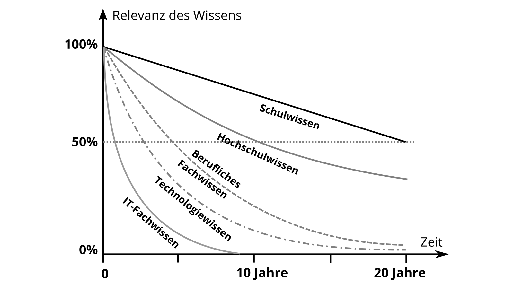

## Lebenslanges Lernen und Wissensarbeit

Wir befinden uns gerade in einem sehr dynamischen Übergang von einer Industrie- zu einer [Wissensgesellschaft](https://de.wikipedia.org/wiki/Wissensgesellschaft): Kennzeichnend hierfür ist, dass Regeln und Normen durch Lernprozesse kontinuierlich in Frage gestellt werden (s.a. [Merkmale der Wissensgesellschaft](https://www.researchgate.net/publication/283061140_Merkmale_der_Wissensgesellschaft)).

In dieser Gesellschaft können wir als Einzelpersonen eigentlich nur durch Lernen erfolgreich sein und zusammen mit Anderen zum Wohlergehen aller beitragen.

Autor/in: geschmacksRaum®

Unter Lernen versteht man den absichtlichen oder beiläufigen Erwerb von Wissen oder Fähigkeiten. Dieser Lernprozess führt zu relativ stabilen Veränderungen des Verhaltens, Denkens oder Fühlens, aufgrund von Erfahrungen oder neuen Erkenntnissen.

1996 wurde mit dem [Delors Report](https://en.wikipedia.org/wiki/Delors_Report) von der Europäischen Kommission ein Gesamtbild des Lebenslangen Lernens ("learning throughout life") gezeichnet und die vier Säulen, die insbesondere in die Aus- und Weiterbildung integriert werden sollten, benannt:

* **Learning to know** - ein breites Allgemeinwissen mit der Möglichkeit, eine kleine Anzahl von Themen zu vertiefen.
* **Learning to do** - nicht nur berufliche Fähigkeiten zu erwerben, sondern auch die Kompetenz, mit vielen Situationen umzugehen und in Teams zu arbeiten.
* **Learning to be** - die eigene Persönlichkeit zu entwickeln und mit wachsender Autonomie, Urteilsvermögen und Eigenverantwortung, handeln zu können.
* **Learning to live together** - durch die Entwicklung eines Verständnisses für andere Menschen und die Wertschätzung von wechselseitigen Abhängigkeiten.

Es gibt aber auch ganz praktische Gründe, die lebenslanges Lernen für dich notwendig machen. Wie man an der Grafik der [Halbwertzeit des Wissens](http://www.online-lehrbuch-bwl.de/lehrbuch/kap3/oe_le/oe_le.pdf) erkennen kann, so verlieren einige Wissensarten schnell an Aktualität und machen daher ständiges Lernen schlichtweg erforderlich. Auch wenn Bereiche wie das Schulwissen einigermaßen stabil bleiben, ist der Bedarf Neues zu Lernen - besonders im Technik- und IT-Bereich - besonders groß.

Das bedeutet für die Bürger einer Gesellschaft, dass sie sich auch nach absolvierter Ausbildung durch Schule und Hochschule kontinuierlich weiterbilden sollten, um nicht den Anschluss zu verlieren. Diesen Lernprozess, der von der Geburt bis zum Tod hin reicht, bezeichnet man als lebensbegleitendes oder [lebenslanges Lernen](https://de.wikipedia.org/wiki/Lebenslanges_Lernen).

Bis zur ersten Ausbildung kümmern sich in den meisten Fällen nicht nur die Eltern, sondern auch der Staat um Lernen und Bildung. Anschließend muss man es für sich [selbst organisieren](https://de.wikipedia.org/wiki/Selbstorganisation).

Autor: Daniel Berkmann

### Wissensarbeit

Peter Drucker weist in seinem Buch Landmarks of Tomorrow schon Ende der 1950er Jahre auf einen Wandel in der Arbeitswelt in Richtung wissensintensiver Arbeitsaufgaben, kurz [Wissensarbeit](https://en.wikipedia.org/wiki/Knowledge_worker), hin.
Der Wissensarbeiter zeichnet sich dadurch aus, dass er über die Arbeitsaufgabe und das notwendige Wissen besser Bescheid weiß als die Manager der Organisation, und sich deshalb - im Gegensatz zum [Taylorismus](https://de.wikipedia.org/wiki/Taylorismus) bzw. dem [Scientific Management](https://de.wikipedia.org/wiki/Scientific_Management), bei dem zwischen Kopf- und Handarbeit getrennt wird - weitestgehend selbst organisiert.

Der Organisationssoziologe Hellmut Willke [definiert Wissensarbeit](https://www.researchgate.net/publication/41011087_Organisierte_Wissensarbeit) als Tätigkeiten wie Kommunikation, Transaktion und Interaktion, die dadurch gekennzeichnet sind, dass sie Wissen erfordern, das nicht einmalig im Leben, etwa durch Erfahrung, Initiation, Lehre, Fachausbildung oder Professionalisierung, erworben wurde und dann kontinuierlich angewendet werden kann. Stattdessen ist genau das Wissen, das im lebenslangen Lernprozess entsteht für die Wissensarbeit charaketistisch und handlungsanleitend. Aus diesem Grund ist relevantes Wissen nicht statisch, sondern sollte

1. kontinuierlich revidiert,
2. permanent als verbesserungsfähig angesehen,
3. prinzipiell nicht als Wahrheit, sondern als Ressource betrachtet werden und
4. untrennbar mit Nichtwissen gekoppelt sein.

Offensichtlich birgt Wissensarbeit Risiken, denn was heute gilt, kann morgen bereits ungültig sein.

Folgende Tätigkeiten gelten, laut der Studie [Tätigkeiten und berufliche Anforderungen  in wissensintensiven Berufen](https://lit.bibb.de/vufind/Record/DS-131131), als besonders wissensintensiv:

* Forschen
* Entwickeln
* Recherchieren
* Dokumentieren
* Ausbilden
* Unterrichten
* Organisieren fremder Arbeitsabläufe (ja, Manager und Führungskräfte sind auch Wissensarbeiter :-)

Wenn dein Arbeitsalltag zu großen Teilen aus einer oder mehrere dieser Tätigkeiten besteht, kannst du dich zu den Wissensarbeitenden zählen und du gehörst zur Kernzielgruppe dieses Leitfadens.

Autor: timothyh

### Produktivität von Wissensarbeit

Die [Produktivität](https://de.wikipedia.org/wiki/Produktivit%C3%A4t) ist klassisch definiert als das Verhältnis von erzeugten Produkten zu den dafür benötigten Produktionsfaktoren. Peter Drucker fasst im Buch "Management Challenges for the 21st Century" die Produktivität von Wissensarbeitern in sechs Faktoren zusammen:

1. Die Produktivität der Wissensarbeiter erfordert, dass wir uns als erstes fragen **Was ist die Aufgabe?**
2. Wissensarbeit verlangt von uns, dass wir die Verantwortung für die Produktivität auf einzelne Wissensarbeitende übertragen, dazu müssen wir ihnen einen Vertrauensvorschuss geben, denn **Wissensarbeitende müssen sich selbst managen.** Dafür muss ein autonomer Handlungsspielraum vorhanden sein.
3. **Kontinuierliche Innovation** ist ein Teil der Arbeit, die in der Aufgabe und Verantwortung von Wissensarbeitenden steht.
4. Wissensarbeit geht einerseits mit einem **kontinuierlichen Lernprozess** und andererseits mit einem **kontinuierlichen Lehren** durch die Wissensarbeitenden einher.
5. Die **Produktivität der Wissensarbeitenden Fachkraft** ist primär keine Frage der Quantität der Ergebnisse. Der Teufel steckt oftmals im Detail, deshalb ist Qualität mindestens genauso wichtig.
6. Abschließend erfordert die Produktivität von Wissensarbeitenden, dass **Wissensarbeitende ein "Aktivposten"** und nicht ein "Kostenfaktor" sind und demgemäß behandelt werden. Wissensarbeitende sind folglich dann besonders produktiv, wenn sie für die Organisation arbeiten wollen und nicht eine der vielen Wahl-Möglichkeiten wählen.

Der viel beachtete TED-Vortrag von Dan Pink zeigt genau diesen Zusammenhang der Bedeutung von Autonomie, dem kontinuierlichen Lernen (Mastery) und der selbständigen Exploration bzw. dem Herausfinden einer relevanten Arbeitsaufgabe (Purpose), die für die Arbeit im 21. Jahrhundert charakteristisch ist [Über die überraschende Wissenschaft der Motivation](https://www.youtube.com/watch?v=rrkrvAUbU9Y).
