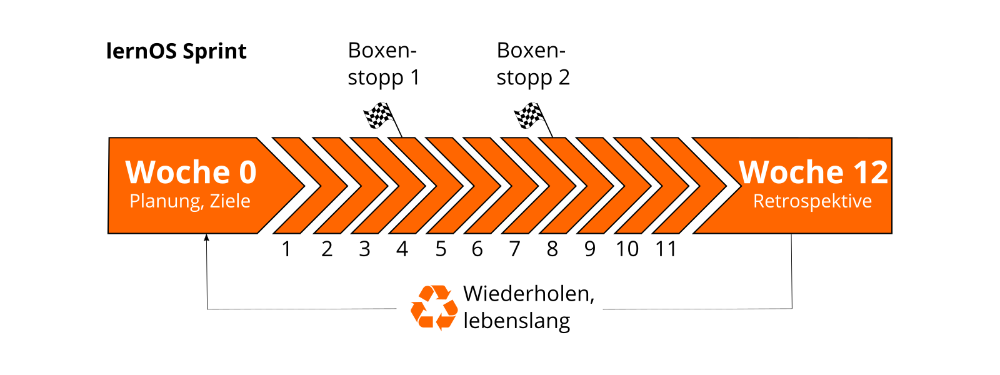
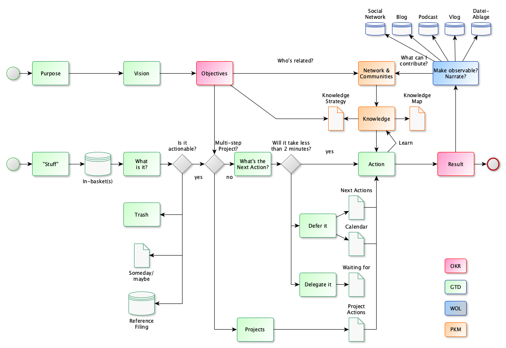

## lernOS Flow - Arbeitsablauf für modernes Arbeiten und Lernen

Mit [Flow](https://de.wikipedia.org/wiki/Flow_(Psychologie)) wird das als beglückend erlebte Gefühl eines mentalen Zustand bezeichnet, bei dem du konzentriert bist und völlig in einer Tätigkeit aufgehst. Im Flow gibt es eine gute Balance zwischen den Anforderungen der Tätigkeit und den eigenen Fähigkeiten, so dass weder Überforderung noch Unterforderung auftreten. Um in unserer schnellen und komplexen Lebens- und Arbeitswelt Konzentration und Fokussierung zusammenzubringen, braucht es dafür ein gutes System, mit dem man in der Lage ist sich selbst zu organisieren.

Für den lernOS Flow sind deswegen auf 13-wöchige Zyklen, die in Anlehnung an [Scrum](https://scrumguides.org) **lernOS Sprints** genannt werden. Jeder Sprint beginnt mit Planung und Zielfindung (Woche 0) und endet mit einer Retrospektive (Woche 12). Als Rhythmus bieten sich die vier Quartale eines Jahres an, das kannst du aber an deine Vorliebe anpassen.

Der lernOS Flow ist ein Arbeitsablauf, den Wissensarbeiter_innen und Lebenslang Lernende für ihr Selbstorganisation verwenden können. Hierfür wird auf Praxis-erprobte Methoden und Ansätze zurückgegriffen:

1. **Objektives & Key Results (OKR)** für zielgerichtetes und fokussiertes Arbeiten und Lernen durch die Definition von Lernzielen und gewünschten Ergebnissen (s.a. [OKR](https://rework.withgoogle.com/guides/set-goals-with-okrs/steps/introduction/) bei Google).
2. **Getting Things Done (GTD)** für produktives und stressfreies Arbeiten und Lernen, indem die Selbstorganisation durch einen 5-Schritte-Prozess strukturiert wird (s.a. [GTD](https://gettingthingsdone.com) von David Allen).
3. **Working Out Loud (WOL)** für das offene Teilen von Arbeitsergebnissen im Netzwerk und das Erzählen von Hintergrundgeschichten (s.a. [WOL Definition](https://thebryceswrite.com/2010/11/29/when-will-we-work-out-loud-soon/) von Bryce Williams, [WOL Circle Guides](https://workingoutloud.com/de/fur-dich) von John Stepper).

Im Diagramm zum lernOS Flow kannst du die Elemente aus den einzelnen Methoden anhand der farblichen Markierung erkennen (OKR: rot, GTD: grün, WOL: blau):

Das Bild ist am besten von links nach rechts zu lesen.  Es gibt zwei mögliche Startpunkte (grüne Kreise) und einen Endpunkt (roter Kreis). Mit dem unteren Startpunkt befasst man sich eher mit dem kurzfristigen und operativen Umgang mit Wissen und Lernen. Der obere Startpunkt bildet die langfristige und strategische Perspektive ab (s.a. [GTD - The 6 Horizons of Focus](https://gettingthingsdone.com/2011/01/the-6-horizons-of-focus/)).

**ProTip:** wenn du privat oder beruflich mit Microsoft 365 arbeitest, findest du im Anhang die Microsoft 365 Edition des lernOS Flows.

