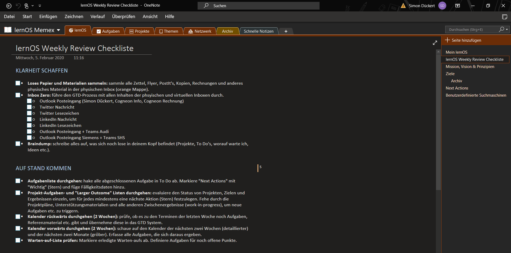

## lernOS Memex - das "2nd Brain" der Lernenden

Die einzelnen Wissens- und Lernumgebungen sind eben so individuell, wie jeder einzelne Mensch es ist. Die Idee des lernOS Memex will hier eine gemeinsame Bezugsgröße schaffen. Memex steht für "Memory Extender" und kann als digitaler Zwilling des eigenen Gehirns, im Englischen auch "second brain" genannt, verstanden werden. Also das worum es in diesem Lernpfad u.a. geht.

Der Memex im lernOS ist ein System, dem der Nutzer vertraut und der neben allen Organisations- und Planungselementen von lernOS auch Verweise und Beschreibungen auf alle weiteren System enthält, die im Rahmen der lernOS Praxis verwendet werden.

Theoretisch kann der Memex auch analog z.B. in Form eines Notizbuchs umgesetzt werden. In der Praxis kommen aber meist digitale Notizbücher oder Scratchpads zum Einsatz (z.B. Obsidian, Logseq, Roam), da diese gegenüber analogen Varianten viele Vorteile bieten. So bieten sie z.B. unbegrenzten Platz, können durchsucht werden sowie Audio- und Videoinhalte enthalten. Mehr dazu im Lernpfad selber.

