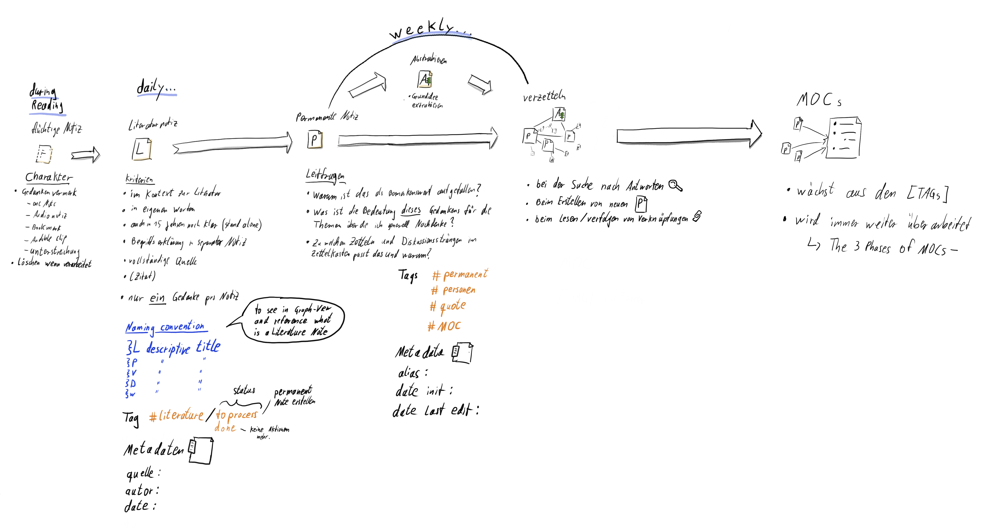
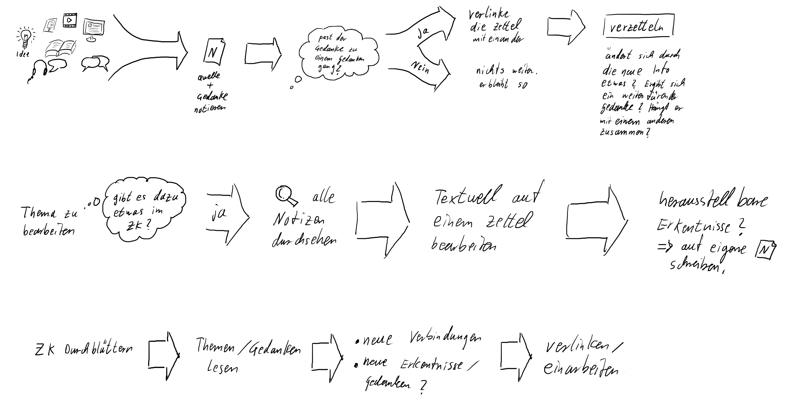
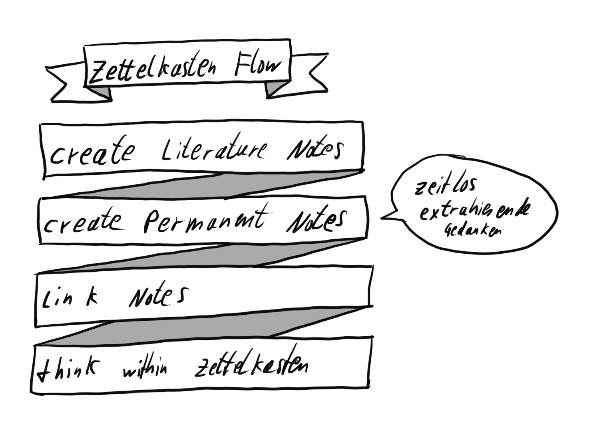
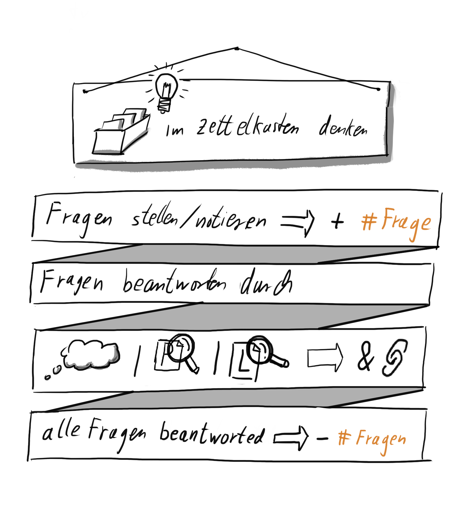

## Kata 15 - Finde deinen Workflow

Verwendet in [Woche 4](2-1-Woche-4.md)

### Theorie
Ein Workflow ist von großem Nutzen, um an einem Thema dranzubleiben und effektiver zu arbeiten. Ein etablierter Workflow hilft dabei, eine Gewohnheit zu finden, die Zeit effektiver zu nutzen, Ablenkungen zu vermeiden und sich auf die Aufgabe zu konzentrieren. Gewohnheiten benötigen weniger Energie und ermöglichen es, den Arbeitsprozess stetig zu optimieren. In einem Zettelkasten-Workflow sollten Schritte wie das Sammeln von Notizen, das Verarbeiten von Notizen, das Schreiben von permanenten Notizen, das Erstellen von Map Of Contents und das Denken im Zettelkasten enthalten sein. Beim Denken im Zettelkasten solltest du Fragen stellen, Antworten finden, neue Ideen generieren, systematisch mit dem Zettelkasten arbeiten und Wissen systematisch miteinander verbinden. Um einen Workflow etablieren zu können, solltest du zunächst ein Ziel definieren, die von dir genutzten Tools auflisten und die Schritte in eine Reihenfolge bringen. Die Schritte und Tools sollten miteinander verbunden werden und der Workflow sollte regelmäßig überprüft und angepasst werden, um ihn aktuell zu halten. Ein Workflow bleibt am Leben, wenn er regelmäßig durchgeführt, überprüft und angepasst wird. Es empfiehlt sich einmal im Quartal 1 Stunde für ein Review als Serientermin zu planen. Regelmäßigkeit in der Ausführung und Überprüfung ist wichtig, um sicherzustellen, dass er noch aktuell ist und deine Bedürfnisse erfüllt. Anpassungen sollten daher regelmäßig durchgeführt werden, um ihn aktuell zu halten.

Hier sind Beispiel-Workflows von denen du dich inspirieren lassen kannst. Alles ist erlaubt, du kannst also auch ganz andere Einstiegspunkte haben.

#### Workflow 1

#### Workflow 2

#### Workflow 3

#### Workflow 4

#### Workflow 5

### Übungen

Du kannst den Workflow mit Stichpunkten beschreiben, in einer Aufzählung, Boxen in Powerpoint aufziehen oder sonst wie einen Workflow beschreiben. Nimm das womit du dich am wohlsten fühlst.

- Überleg dir ob du einen großen Workflow erstellst oder mehrere kleinere für Verschiedene Bereiche
	- z.B. Sammeln von Notizen; Verzetteln; Denken; Texte Schreiben
- definiere dein Ziel, wobei dir der Workflow helfen soll
- schreibe dir auf welche Tools du für die Arbeit mit deinem Zettelkasten nutzt
	- Zettelkasten-Umgebung
	- digitale Reader und Hilfsprogramme
	- Liste Schnittstellen zwischen Tools auf
	- Bücher, Lineal, Marker, College block etc.
- Erstelle einen groben Ablaufplan der die Schritte enthält die du beim Zettelkasten durchführst
- Füge zu den Schritten die Tools hinzu die du benötigst
- Prüfe für, ob du Potenzial zur Optimierung in dem Ablaufplan siehst
- Füge Details hinzu, falls sie dir nötig erscheinen

### Lernziel
- erkannt, dass ein guter Workflow entscheidend für dauerhaften Erfolg ist.
- verstanden, dass ein Zettelkasetn nur dann seine volle Kraft entfaltet, wenn er kontinuierlich im Einsatz ist.
- Du hast einen eigenen Workflow

