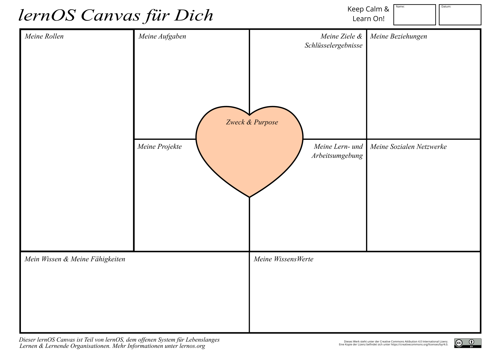

Autor/in: Nali

## Dein lernOS Canvas - Überblick über Wissens- und Lernbedarfe

Mit diesem Canvas kannst du dein Lernen planen und dabei einen guten Überblick behalten, also nichts Wichtiges vergessen.
Die visuelle Struktur erleichtert dir auch, die einzelnen Bestandteile aus denen dein aktueller Wissens- und Lernbedarf besteht, zu überprüfen und vorhandene Ressourcen mit deinem Lernbedarf abzugleichen. Denn ein Bild sagt mehr als Tausend Worte!
Du kannst es zum Beispiel auch für die parallele Bearbeitung mehrerer Bereiche verwenden.

Alex Osterwalder hatte als erster die Idee für einen lernOS Canvas. Er entwickelte auch den [Business Model Canvas (https://en.wikipedia.org/wiki/Business_Model_Canvas), den man für die Erarbeitung von Geschäftsmodellen nutzt.
Beide folgend derselben Grundstruktur und sollten von dir zunächst als Einstieg ausgefüllt werden. Auf diese Weise bekommst du einen passenden Überblick.
Der [lernOS Canvas](https://raw.githubusercontent.com/cogneon/lernos-zettelkasten/main/de/src/images/lernOS-Canvas-for-you-Canvas-de.png)
**ProTip:** Sei flexibel und arbeite mit Haftnotizen, die du jederzeit nach Bedarf verwenden kannst.

Im oberen Teil des Canvas kannst du deinen Namen und das Datum der Erstellung bzw. letzten Änderung eintragen. Wenn du mit dem Canvas elektronisch arbeiten willst, kannst du ihn z.B. in OneNote oder ein digitales Whiteboard kopieren. Für die erste Befüllung des Canvas kannst du dir z.B. folgende Fragen stellen:

* **Zweck & Purpose:** Wofür lebst du? Was möchtest du in deinem Leben erreichen?
* **Ziele & Schlüsselergebnisse:** Welche Ziele hast du in den nächsten 12 Wochen? Welche messbaren Ergebnisse gibt es zu den Zielen?
* **Meine Rollen:** Was sind deine aktuellen Rollen? Welche Ziele ergeben sich aus diesen?
* **Meine Aufgaben:**  Was sind deine aktuellen Aufgaben? Welche Ziele ergeben sich daraus?
* **Meine Projekte:** Was sind deine aktuellen Projekte? Welche Ziele ergeben sich aus diesen?
* **Meine Sozialen Netzwerke:** Welche internen und externen sozialen Netzwerke (digital und analog) helfen dir bei der Vernetzung?
* **Meine Lern- und Arbeitsumgebung:** Wie sieht deine Lern- und Arbeitsumgebung aus (Infrastruktur, Inhalte, Tools, Methoden etc.)?
* **Mein Wissen & Meine Fähigkeiten:** Welche Wissensgebiete und Fähigkeiten sind für deine Ziele, Rollen, Aufgaben und Projekte wichtig? Was musst du noch lernen?
* **Meine Wissenswerte:** Welche WissensWerte (Dokumente, Checklisten, Videos etc.) hast du? Welche davon kannst du deinem Netzwerk anbieten?

