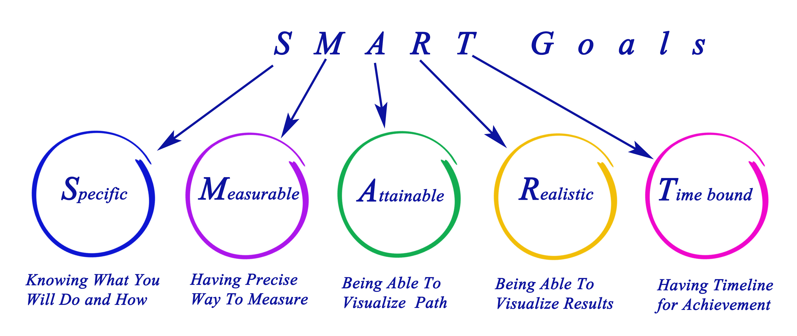
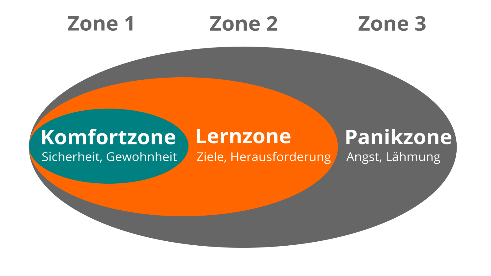

## Kata 1

### Mein Ziel für die nächsten 12 Wochen

#### Theorie
Was willst du in den nächsten zwölf Wochen erreichen? Du kannst ein Ziel auswählen, das dir wirklich, wirklich wichtig ist und mit dem du beim Sprint ganz konkrete Fortschritte machst. Besonders für Persönliches Wissensmanagement (PKM) - Einsteiger*innen ist es jedoch nicht die oberste Priorität, das Ziel zu erreichen. Im Fokus steht neben dem Erlernen des Basiswissens, der Umgebung, der Auffindbarkeit und Dauerhaftigkeit von Notizen, immer noch ganz besonders das regelmäßige Anwenden der neu gewonnenen Fähigkeiten.
Insbesondere und zu guter Letzt steht für uns eine Hauptsache im Mittelpunkt: ganz ganz viel Spaß zu haben! :D

Um einen optimalen Lernerfolg zu gewährleisten, ist es nämlich wichtig, dir selbst Ziele zu setzen, die dich motivieren und mit denen du deine Fortschritte greifbar und sichtbar machen kannst. Du wirst deine Ziele nach der SMART-Formel setzen oder die OKR-Methode von Google^[Links in den Kapitel "Weitere Informationen"] verwenden, um dein Ziel zu definieren. Überlege, ob du vielleicht auf ein konkretes Produkt hinarbeiten möchtest. Das könnte zum Beispiel ein Blog-Artikel für deine Koleg*innen sein, oder eine erste Veröffentlichung, oder, oder, oder...
Visualisiere dein Ziel. Für diesen Zweck kannst du im Internet unterschiedliche technische Werkzeuge einsetzen.  

Überlegt euch, wie ihr euren Fortschritt im Circle teilen wollt. Anders ausgedrückt, wenn ihr euch an erster Stelle mit dem Check-In auseinandersetzt, ist das ein bisschen wenig. Überlegt, welche Dokumentations-Tools es gibt, mit denen sich euer Fortschritt gut protokollieren lässt.

###### Ziele definieren mit der SMART-Formel

Autor: Dmitry

Der Einsatz der SMART-Methode ist ein guter Weg, ein Ziel zu definieren. Dabei werden verschiedene Kriterien angewandt, an denen sich die Zieldefinition misst. Auf diese Weise hast du die Garantie auch ein smartes Ziel zu erreichen.

**S**pezifisch: Ist wirklich klar ausgedrückt, was du machen möchtest, oder bist du vielleicht zu schwammig in deiner Formulierung? Was gehört dazu, und ganz besonders was nicht? Nur wenn du wirklich genau weißt, was du tun möchtest und gleichzeitig die Grenzen deines Vorhabens kennst, kannst du dich auf den Weg machen und sicher sein, dass du auf dem Weg in jedem Fall ankommst ohne dich dabei zu verzetteln oder gar die Orientierung zu verlieren.

**M**essbar: Was muss passiert sein, damit du sagen kannst, dass dein Ziel erreicht worden ist. Welches Arbeitsergebnis liegt dann vor? Wenn du zum Beispiel "besser" in etwas werden möchtest, was musst du wie oft machen, um genug Übung zu erlangen? Formuliere so schlüssig und messbar, dass du genau das erreichen kannst. Frage dich daher im Wesentlichen, als was du besser werden möchtest oder woran dieses "besser" denn genau festmachen lässt. Charakterisiere den ersten Punkt, denn je spezifischer du bei der Definition deines Zieles bist, um so eher hast du die Chance ein Ergebnis zu bekommen, das deinen Vorstellungen entspricht, das sich weiter verbesser lässt und das sich merklich bewerten lässt.

**A**ttraktiv: Dein Ziel muss dich motivieren. Du musst es erreichen wollen, wenn du 12 Wochen die Kraft aufbringen möchtest es wahr werden zu lassen. Deshalb ist dieser Punkt besonders wichtig. Am besten sollte es ein Ziel sein, dass du persönlich für dich ausgesucht hast und mit dem du dich auch zu 100% identifizieren kannst. Ein Ziel das Andere für mich setzen wird selten den gleichen Wunsch in mir auslösen, es zu erreichen, wie eines das meinem eigenen Herzen entsprungen ist. In manchen Ausführungen zur SMART-Formel steht das A auch für **A**nspruchsvoll. Will meinen, dass dein Ziel nicht zu einfach sein sollte. Ein bisschen anstrengen und herausfordern sollte man sich schon, denn wer zu weit von seinen persönlichen Grenzen entfernt bleibt und eigentlich noch in seiner Komfortzone chillt, der kann sich selten wirklich verbessern. Letztendlich musst du etwas über die Komfortzone heraus gehen ohne dich vollständig zu überfordern, denn dort beginnt das Wachstum.
Obacht! Sich zu überfordern bringt keine nachhaltigen Ergebnisse und im Großen und Ganzen soll dieser Lernpfad ja vor allem eines bringen: sehr viel Spaß! Und der kann bei zu ambitionierten Zielen am Ende schnell auf der Strecke bleiben.

**R**ealistisch: Der Lernpfad geht 12 Wochen und deshalb solltest du auch ein Ziel wählen, dass in dieser Zeit wirklich zu erreichen ist. Bleibe bodenständig bei der Definition deiner Ziele. Im Schneckentempo und mit Beharrlichkeit kannst du alles erreichen. Schlüssig ist es auch, sich vorab zu hinterfragen:
Bist du eine der Personen, die ihre Ziele gerne etwas anspruchsvoller wählen?
Wie viel Zeit steht dir denn wirklich in der Woche zur Verfügung?
Passt das Ganze wirklich hinein in den Rahmen der 12 Wochen des Lern-Sprints?
Wenn es vielleicht sein muss, dann verabschiede dich von der einen oder anderen Idee erst mal. Letztlich ist der erste Sprint ein gutes Training, dass am Ende in Fleisch und Blut übergeht. Der aktuelle Lern-Sprint wird eventuell erst ein Auftakt gewesen sein. :-)

**T**erminiert: Eine weitere wichtige Anforderung an dein Ziel, die du beachten solltest, ist der Termin der Fertigstellung.
Im Rahmen des Lern-Sprints kann dieser Termin tatsächlich sehr genau bestimmt werden. Und das ist auch wichtig, denn so bekommst du die Möglichkeit zu prüfen, ob du dich hinsichtlich der Arbeitsergebnisse, offener Punkte und eventueller Probleme und Hindernisse noch auf einem guten Weg befindest, oder ob du unter Umständen mehr Energie in deine Arbeiten am Projekt stecken musst oder dein Ziel schlüssig verkleinern musst, um es überhaupt noch erreichen zu können.
In Woche 7 werden wir uns die ersten Zwischenergebnisse ansehen. Ein guter Moment das eigene Ziel noch mal aus der SMARTen Perspektive zu betrachten und gegebenenfalls ein wenig neu zu justieren.

**Beispiel für eine Zielsetzung mit OKRs**

So einfach der Zettelkasten zu erklären ist, so herausfordernd kann zu Beginn die Arbeit damit sein. Aus diesem Grund empfehlen wir ein konkretes Ziel festzulegen und eventuell über ein kleines Projekt einzusteigen. Um das etwas konkreter zu machen, hier ein Beispiel.

Nima hat zu studieren begonnen möchte in Zukunft in der Wissenschaft arbeiten, weshalb sauberes wissenschaftliches Arbeiten und die dazugehörige Schreiborganisation von Anfang an geübt werden soll.

Nimas Ziel für die 12 Woche im Zettelkasten Lernpfad ist es eine Routine im Umgang mit dem Zettelkasten zu entwickeln. Deshalb überlegt Nima mit einer anstehenden Seminararbeit genau an dieser Routine zu arbeiten. Für den Einstieg ist es sehr anspruchsvoll 15 Seiten aus dem Zettelkasten heraus zu schreiben, weshalb es sinnvoll ist noch weitere Schlüsselergebnisse zu definieren.

Die Frage, die einem dabei helfen kann, welche Key Results erreicht werden soll lautet: Woran erkenne ich, dass ich meinem Objective näher gekommen bin?

1. Key Result: Das Schlüsselergebnis, dass auf der Hand liegt, sind die 15 geschriebenen Seiten.
2. Key Result: Nima hat einen vollständigen Workflow erarbeitet. Dazu zählt eine Leseroutine, die Übertragung der Notizen in permanente Notizen, die Verlinkung von Gedanken,....

**Weitere Methoden zur Zielsetzung**
WOOP, PACT, OKR:

**Weitere Informationen:**

-   [WOOP, PACT, OKR](https://youtu.be/ogfCDKw2lbU) (deutsch)
-   Wikipedia Artikel [SMART Criteria](https://en.wikipedia.org/wiki/SMART_criteria) (englisch)
-   MIT Sloan Artikel [With Goals, FAST Beats SMART](https://sloanreview.mit.edu/article/with-goals-fast-beats-smart) (englisch)
-   Artikel [OKR – Googles Wunderwaffe für den Unternehmenserfolg oder: Raus aus der Komfortzone](https://t3n.de/news/okr-google-wunderwaffe-valley-ziele-530092/) (deutsch)
-   Ted Talk [How We Can Make the World a Better Place by 2030](https://www.youtube.com/watch?v=o08ykAqLOxk) (englisch)
-   Video How Google Sets Goals: [OKRs mit Google Ventures Partner Rick Klau](https://www.youtube.com/watch?v=mJB83EZtAjc) (englisch)
-   Video [OKR-Agiles Zielmanagement für den Mittelstand](https://www.youtube.com/watch?v=_ugCKONbBNs) (deutsch)
-   Video [OKR - Führen mit Objectives and Key Results (OKRs) - so funktioniert das Google Leadership System](https://www.youtube.com/watch?v=y-aIyqMZfnE&t=) (deutsch)
-   Buch [Introduction To OKRs von Christina Wodtke](https://www.oreilly.com/business/free/files/introduction-to-okrs.pdf) (englisch)
-   Buch [The Beginner’s Guide To OKR von Felipe Castro](https://felipecastro.com/resource/The-Beginners-Guide-to-OKR.pdf) (englisch)

#### Übungen
- Definiere mit einer Methode deiner Wahl dein(e) Ziel(e) für diesen Lernsprint
- Teile dein(e) Ziel(e) mit dem Circle

#### Reflexionsteil
Was läuft bereits gut?
Was hast du bereits erreicht?
Wer/was konnte dich dabei unterstützen?
Woran würdest du merken, dass du dein Ziel vollends erreicht hast?

#### Lernziel
-   Du unterstützt deinen Lernerfolg durch Messbar machen deiner Ziele.
-   Du motivierst dich und die anderen Teilnehmer*innen durch Greifbar machen der Ziele.

### Ein Termin mit dir selbst

#### Theorie
Nimmst du dir ausreichend Zeit für deine persönliche Entwicklung und für die Arbeit an deinen Zielen? Viele Menschen sind mit ihren täglichen Aufgaben beschäftigt und kümmern sich nicht genug um ihre Entwicklung und ihr Wohlbefinden. Ein guter Ansatz ist es, einen Termin mit sich selbst zu vereinbaren und sich diese Zeit im Kalender zu reservieren.

##### Weitere Informationen:

-   Video: [7 Big Rocks](https://www.youtube.com/watch?v=fmV0gXpXwDU)
-   Podcast: [Never enough time? Schedule your priorities by colorcoding your calendars](http://www.asianefficiency.com/schedule-management/color-code-your-calendar/)

#### Übungen

Überprüfe deinen Kalender und suche nach möglichen Terminen mit dir selbst. Eine Stunde oder sogar 30 Minuten pro Woche ist ein guter Ausgangspunkt. Trage dir einen Termin mit dir selbst in den Kalender ein. Mache ihn nach Möglichkeit zu einem wiederkehrenden Termin, damit diese Zeit für dich zur Gewohnheit wird. Finde mindestens fünf Termine:

1.  …

2.  …

3.  …

4.  …

5.  …

#### Reflexionsteil
- Besprecht eure Ansätze im Circle.
- Hast du jede Woche den gleichen Zeit-Slot?
- Fällt es dir leichter dynamisch eine Stunde jede Woche einzuplanen?
- Wie planst du normalerweise wiederkehrende Termine und fühlst du dich mit der Methode wohl?

#### Lernziel

-   Du gibst ein Commitment für dich, dir selbst diesen Lernraum für die Übungen zu geben.
-   Du schaffst notwendige Rahmenbedingungen, um den Circle erfolgreich durchzuführen.

