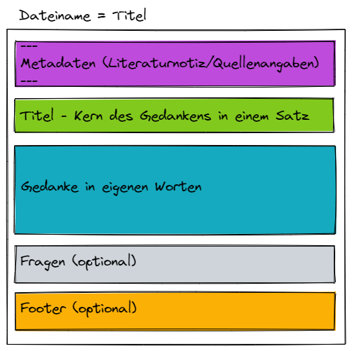

## Woche 3 - Notizen kennenlernen

### Theorie

#### Typen von Notizen
Die Begriffe müssen nicht zwingend genutzt werden, und die Typen können sich überschneiden und ineinander übergehen. Betrachte es einfach als hilfreiches Hintergrundwissen zur Orientierung und bleib in der Anwendung selber offen und flexibel. Der Zettelkasten ist ein lebendes System und somit passt er sich an dich an.

##### Flüchtige Notizen
Wenn du einen Text liest und dabei Untersteichst, Anmarkerst, ein paar Stichpunkte an den Rand schreibst, oder auch während dem gehörten Stichpunkte aufschreibst, so sind das Flüchtige Notizen. Flüchtig da in der Regel nach ein paar Stunden, nach ein paar Tagen du den Sinn deiner Unterstreichung, Stichpunkte nicht mehr so ganz erfassen kannst oder ganz vergessen hast. Vielleicht ist dir das schon mal in der Schule so ergangen als du dich für eine Klassenarbeit vorbereiten wolltest und deine Notizen durchgegangen bist? ;-)

##### Literatur Notizen
Die Literaturnotiz, oder auch bibliographische Notiz ist der Verweis auf die Quelle der Information. Die Literaturnotiz hat somit die Aufgabe die Quelle der Information fest zu halten. Je nachdem was dein Anspruch an dich selber ist wirst du hier also mehr oder weniger Informationen festhalten. Wenn du Wissenschaftlich arbeitest eher mehr, dazu gibt es in der Regel allgemeinübliche Vorgaben auf die wir hier nicht weiter eingehen. Davon abgesehen solltest du dir auf jeden Fall immer folgende Informationen notieren
- Autor
- Buchtitel/Internetlink
- Datum

##### Permanente Notizen
Deine Gedanken zur Information befinden sich in den Permanenten Notizen. Jeder Zettel den du in deinen Zettelkasten steckst ist dafür vorgesehen für immer in deinem Zettelkasten zu bleiben. Daher auch permanent. Dabei ist es irrevlevant ob du den Zettel immer wieder mit den neuesten Erkenntnissen umschreibst, oder neue Zettel mit neuen Erkenntnissen anlegst und verlinkst.

##### Map of Contents / Index
Map of Content oder auch Index-Zettel bilden Einstiegspunkte auf höherer Ebene. Später (in Woche 9) werden wir noch dazu kommen wie solche Zettel erstellt werden. Hier geht es nur darum, dass du bereits weißt, dass es so etwas gibt. Wenn du irgendwann sehr viele Zettel in deinem System hast, wirst du eine Methode brauchen deine Gedanken wiederzufinden wenn du sie brauchst. Und dabei helfen diese Map Of Contents. Es kann übrigens mehrere Ebenen davon geben, je nachdem wie Umfangreich deine Gedanken zu einem Themenfeld sind.

#### Struktur - DNA einer Notiz
Eine Struktur für Notizen? Da es nicht ausreicht, den Gedanken einfach festzuhalten, sondern dieser schlüssig "in die Hand" genommen werden will, um kreativ in (d)einem Kontext zu stehen, gibt es hierfür eine Struktur. Der Gedanke selber ist sicherlich das wichtigste am ganzen, letztlich entstammt er aus einem Zusammenhang und wird in einem neuen gedacht. Direkt im Anschluss daran steht die Wiederauffindbarkeit des Gedankens. Einerseits musst du ihn schnell begreifen und andererseits geschieht dies nur, wenn du dem immer gleichen Aufbau der Notiz folgst. So hat dein Gehirn entsprechend die Kapazitäten, die es braucht, frei, um die Information tatsächlich dynamisch zu erfassen. Der Wiedererkennungseffekt, der in der DNA deiner Notiz liegt, kann dir tatsächlich gute Dienste leisten...

Du kannst deine eigene Struktur verwenden. Vielleicht hast du bereits eine in der du dich wohl fühlst und möchtest sie weiter verwenden. Das ist völlig in Orndung. Du kannst dir auch eine nach deinen Vorstellungen erstellen. Wichtig ist, dass du darin möglichst konsequent bleibst. Änderungen über die Zeit sind mit steigenden Erkenntnissen natürlich. Jede Woche oder gar jede Notiz solltest du deine Struktur jedoch nicht neu erfinden. ;-)

Hier nun ein Vorschlag einer Struktur

##### Metadaten
Hier lassen sich Informationen wie Autor, Quelle, Datum, Tags und Alias eintragen. Bei den meisten PKM-Programmen können diese Informationen auch geziehlt durchsucht und dargestellt werden. In den Metadaten können somit auch die Informationen der Literatur-Notiz eingebettet werden.

##### Titel
Jede Notiz braucht auch einen Titel mit dem sie eineindeutig identifiziert werden kann.

##### Gedanke
Hier steht nun die eigentliche Notiz. Der Gedanke den du hast. Wissen, Überlegungen, Schlüsse, sprich das was du dazu im Kopf hast.

##### Fragen
Wenn du dir selber Fragen stellst zu dem Gedanken kannst du sie in einem extra Fragen-Abschnitt setzen. So findest du deine noch unbeantworteten Fragen immer sofort.

##### Footer
Im Footer könnten z.B. links zu relevanten anderen Notizen stehen die nicht im Text unter gekommen sind, aber dennoch eine Relevanz zum Thema haben. Auch hier könnte die Quelle, die Literaturnoitz, untergebracht werden.

#### Notiz in eigenen Worten
Wenn du einen Gedanken in eigenen Worten wiedergeben kannst, dann hast du den Gedanken verstanden. Im Wesentlichen kannst du damit überprüfen, ob du das Wissen nun erworben hast oder nicht. Wenn du den Gedanken in eigenen Worten ausformulierst und dafür nicht die passenden Worte findest, merkst du, dass du es doch nicht verstanden hast oder üben solltest. Kannst du es hingegen in eigenen Worten ausdrücken, wirst du dafür bereits dein eigenes sprachliches (oder eben auch visuelles) Meta-Model verwenden. All das garantiert dir mit großer Wahrscheinlichkeit, dass du auch in ein paar Jahren noch die Idee wiedergeben kannst und sie verstanden ist. Auf dieses Thema wird in der Kata _dauerhafte Notizen erstellen_ ausführlich eingegangen.

Autor/in: PicoStudio

#### Progressive Summarization

Progressive Summarization ist eine Technik um einen Text in iterativen Schritten zusammen zu fassen und auf das Wesentliche zu reduzieren.
Idealerweise bleibt nach jeder Iteration 10% Text übrig.

* Stufe 1: der Vollständige Textausschnitt aus einer Quelle
* Stufe 2: die wichtigsten Aussagen/Sätze des Textes unterstreichen oder Fett markieren
* Stufe 3: Aus den unterstrichenem/fett markierten die wichtigsten Schlagwörter Angemarkert die für die Aussage wichtig sind.
* Stufe 4: Eine Zusammenfassung in eigenen Wörtern
* Stufe 5: Verzetteln

Bei diesem Vorgang bleibt der ursprüngliche Text jederzeit Verfügbar. Wenn eine höhere Stufe doch nicht verstanden wird, kann die Stufe darunter gelesen werden. Die Methode agiert in etwa so wie ein Sicherheitsnetz.
Auch kann die Methode noch gut eingesetzt werden, wenn nicht mehr ganz so viel Energie zur Verfügung steht.
Die Methode ist eine Methode, sie muss nicht genutzt werden. Du kannst das Gelesene, bzw. Gehörte oder Gesehene auch direkt als Audio aufsprechen, dadurch deine soziale Präsenz innerhalb einer Lerngruppe erhöhen, oder sie in eigenen Worten zeitnah wiedergeben.

### Übungen
- Notiere dier als Vorbereitung zum Weekly deine Fragen die du zu dem oben beschriebenem hast um sie im Weekly zu besprechen
- Habt ihr alles verstanden (Diskussion und Fragen)? Diskutiert euer Verständnis zu Notizen und klärt die Fragen die jeder hat

### Reflexionsteil
- Fühst du dich abgeholt oder verunsichert mit den Informationen oben?

### Lernziel
- was eine Notiz mindestens beinhaltet
- was optional in einer Notiz hilfreich ist
- möglichkeit der Selbstprüfung ob du das Wissen verstanden hast
- essentielle Aussagen aus Texten herausarbeiten können
- verschiedene Arten von Notizen und deren Bedeutung kennenlernen

