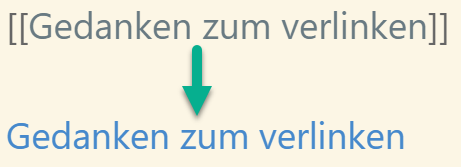

## Kata 7 - Erste Notizen erstellen

Verwendet in [Woche 3](2-1-Woche-3.md)

### Theorie

Ein erfolgreiches persönliches Wissensmanagement im Zettelkasten ist kein Sprint sondern ein Marathon. Nimm dir deshalb Zeit, um regelmäßig Notizen anzulegen und zu verarbeiten. Jede Notiz, jede Verlinkung von Notizen und die dabei entstehenden Gedanken helfen dir dabei die  Zettelkasten-Methode zu verinnerlichen.

Um das Anlegen und Verarbeiten von Notizen einfacher und energieeffizienter zu gestalten, solltest du Routinen aufbauen.  Am besten du trägst Zeiten in deinem Kalender ein, an denen du Notizen erstellst und verarbeitest.

Flüchtige Notizen, (z.B aus Meetings oder Vorlesung), solltest du zeitnah verarbeiten, um dich später besser daran erinnern zu können. Je kürzer der Abstand zwischen dem Entstehen der flüchtigen Notiz und ihrer Verarbeitung ist, desto besser kannst du dich noch an den Kontext beim Notieren der flüchtigen Notiz erinnern und in eine permanente Notiz schreiben.

Um deine erste Notiz im Zettelkasten anzulegen, kannst du die Informationen aus Woche 3 (Notizen kennenlernen) nutzen. Das Thema deiner ersten Notiz ist dabei nicht so wichtig, es sollte einfach etwas sein, das dich interessiert, aber nicht so wichtig ist, dass es dich lähmt. Du kannst alle deine Gedanken in eine Notiz schreiben oder für jeden Gedanken eine einzelne Notiz anlegen. In der nächsten Woche (Woche 6) werden wir dieses Thema noch mal geziehl aufgreifen.

#### Tipp
Wenn du dir unsicher bist, welche Informationen du in deinen Zettelkasten mit aufnehmen solltest, kannst du die Information auf folgende Kriterien hin prüfen: die Information,
- spricht mich an
- macht mich nachdenklich
- brauche ich für ein Thema, an dem ich arbeite.
Schau bei Bedarf noch einmal in die Kata  _Woche 3 - Notizen kennenlernen_ rein.

#### Tipp 2
Um in Mark-Down Links zu erstellen einfach \[\[ \]\] um den Notiznamen setzen und es wird daraus ein Link, das Funktioniert auch in OneNote um Links auf Seiten zu erzeugen.

### Übungen
- Notiz(en) erstellen
	- Lies einen Artikel/Buch/Thema, das dich interessiert und erstelle daraus Notiz(en)
- Optional: Setze dir einen Regeltermin, der über den Sprint hinausgeht, um zu einem festgelegten Zeitpunkt deine flüchtigen Notizen zu verarbeiten.
	- zusätzlich zum Regeltermin für den Sprint kannst du einen weiteren Termin für deinen Zettelkasten ins Leben rufen

### Lernziel
- Du kannst, eine Notiz im Zettelkasten erstellen, die du auch in 10 Jahren verstehst.
- Du hältst deine Regeltermine ein.
- Du legst regelmäßig Notizen in deinem Zettelkasten ab.

