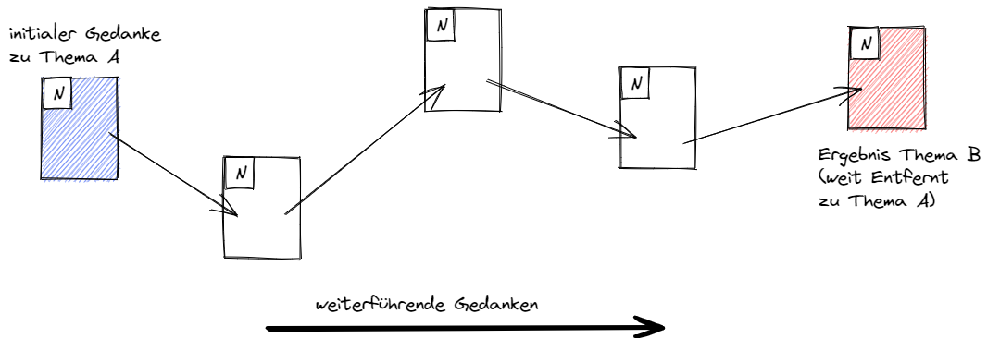
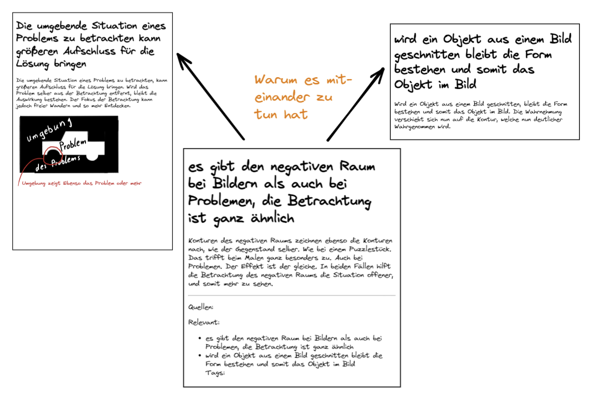

## Kata 9 - Verzetteln

Verwendet in [Woche 6](2-1-Woche-6.md)

### Theorie
Wir starten bei einem Gedanken und kommen von dort sequenziell zu einem nächsten Gedanken. Am Ende sind wir durch eine Verkettung von einem Startpunkt zu einem ganz anderem Punkt gekommen.

Das Gleiche passiert nun auch mit dem Verlinken von Notizen. Ein Gedanke startet in einer Notiz, die zu einem weiteren Gedanken (Notiz) führt, und immer weiter. Das ist ein grundlegender Aspekt des Verzettelns, das Verbinden von Informationen die miteinander zu tun haben.

Aus diesem Verbinden der Informationen entstehen Themen-Cluster. Das ist es, was man in diesem Zusammenhang unter Bottom-Up versteht. Es werden nicht im Vorfeld Bereiche/Themen definiert, sondern die Themen bilden sich durch das Ansammeln von Wissen und Vernetzen miteinander zu Themen-Bereichen.

So entstehen durch das Verzetteln nicht nur Themen-Cluster, sondern auch natürliche Einstiegspunkte für Themen. Es _wachsen_ Verbindungen zwischen Themen, die so vorher noch nicht bekannt waren. Daraus können neue Ideen entstehen oder gar völlig neue Ansätze: etwas Neues entsteht dabei. Auf diese Weise verbindet dein Wissen sich in deinem eigenen Zettelkasten ganz so, wie es in der neuronalen Struktur deines Gehirns angelegt ist und dabei sinkt es immer tiefer ein.

Eine Information wird am besten gefunden, wenn viele Verlinkungen auf ihr sind. Das ist durch das System des Gehirns so vorgegeben. Dies nutzt du beim Anlegen deiner Notiz. Daher wird mit dem Verlinken von relevanten Informationen die Auffindbarkeit und die Merkfähigkeit der Information gesteigert. Auch dafür ist das Verzetteln wichtig. Es hält die Informationen im Zettelkasten nämlich zusammen und macht sie so erreichbar, dass du damit auf einer tieferen Ebene (deines Langzeitgesdächtnisses) damit denken und arbeiten kannst.

Das Verzetteln wird umso wichtiger und klarer, desto mehr Notizen in deinem Zettelkasten sind. Auch wenn du erst wenige Notizen in deinem Zettelkasten hast, lohnt es sich jetzt damit anzufangen, damit er wächst. Dadurch speicherst du den Wissen und vertiefst et gleichzeitig.

### Übungen
In der letzten Kata hast du bereits Notizen atomarer gemacht, so dass du den Gedanken der Notiz nun schneller erfassen kannst.

Geh durch die Notizen in deinem Zettelkasten und wenn dir auffällt, dass zwei Ideen zusammengehören, aufeinander aufpassen können oder in sonst einer Verbindung zueinander stehen, verlinke sie miteinander.

Wenn dir beim Lesen der Notiz Fragen in den Sinn kommen, such nach Antworten in deinem Zettelkasten und verlinke diese, wenn du passende Notizen dazu findest.

Zerlege weitere Notizen in kleinere Bestandteile (Stichwort Atomarität, von Woche 5) und verlinke sie dabei, sobald du den Eindruck bekommst, dass sie in einer Beziehung zueinander stehen sollten.

Du kannst auch beim Einpflegen permanenter Notizen direkt Links zu anderen Notizen erstellen bei denen du weißt, dass eine Beziehung zueinander besteht.

Du kannst den Link in den Footer^[Der unterste Bereich einer Notiz] Bereich setzen oder auch inline^[Direkt in den Text bzw. Satz einbauen] verlinken.

Und behalte dabei im Hinterkopf, eine Verbindung besteht nicht nur zu denselben Themen, sondern kann auch eine völlig neue Verbindung sein, eben jene, die du siehst.
Du könntest auch eine neue Notiz erstellen, in der du für dich erläuterst, warum du eine Verbindung zwischen den beiden Notizen siehst. Das folgende Bild verdeutlicht dies.

Anmk.: Falls du sehr viel verzettelst und intensiv an einem Thema arbeitest kann es Sinn machen dir einen zusätzlichen Termin pro Woche einzurichten bei dem du dich nur um das Verlinken von Ideen untereinander konzentrierst. Tags wie es sie in Obisidian gibt können hierbei hilfreich sein noch nicht verlinkte Notizen zu verlinken.

### Lernziel
- Du hast neue Assoziationen erhalten und Verbindungen geknüpft
- Du hast neue Themen-Cluster gebildet

