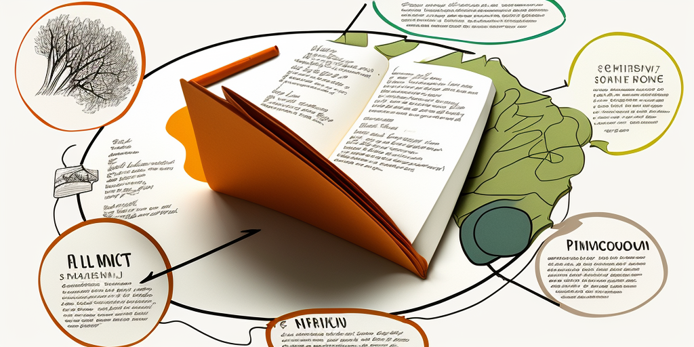

## Woche 3 - Notizen kennenlernen

In dieser Woche richtest du dir deine Persönliches Wissensmanagement (PKM) Umgebung ein.

Als Vorbereitung

[ ] `Kata 5: Notizen kennenlernen` lesen

[ ] `Kata 6: Progressive Summarization` lesen und an einem Artikel/Website ausprobieren

Im Weekly

[ ] Check in (2 Minuten pro Member)

Was hat dich die letzte Woche im Zusammenhang mit persönlichem Wissensmanagement beschäftigt?

Leitfragen:
- Ist eine einheitliche Struktur förderlich oder unnötig?
- Progressive Summarization oder direkt Zusammenfassen in eigenen Worten?
- Fühst du dich abgeholt oder verunsichert mit den Informationen in den Katas?

[ ] Check-Out (1 Minute pro Member)

Was nimmst du dir für die nächste Woche vor?

