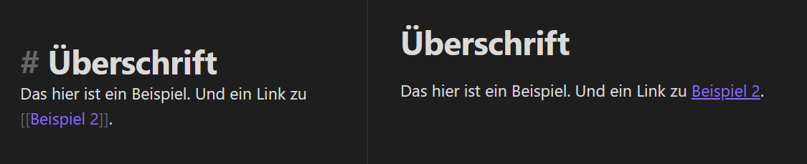

# Anhang

## Was ist Mark-Down?

Markdown ist eine Auszeichnungssprache. Das bedeutet, es werden Steuerzeichen im Text verwendet um anzuweisen wie der Text dargestellt werden soll. Die Steuerzeichen kommen also wirklich direkt in den Text. Es ließe sich mit HTML^[Internetseiten werden mit HTML beschrieben.] oder LaTeX^[Eine Zeichensetzsprache die besonders in der Wissenschaft angewendet wird.] vergleichen. Doch keine Sorge, du musst hier nicht programmieren, sehr wenige Zeichen reichen aus und die Programme stellen den Text dann ohne die Steuerzeichen da.
Damit du dir das jetzt auch vorstellen kannst, hier ein praktisches Beispiel worum es geht.

links ist der Text mit den Formatierungszeichen. Links ist, was du dann in der Darstellung siehst.

Der große Vorteil ist, dadurch das es alles nur Text Dateien sind (wie mit der Endung .txt die du manchmal auf dem Computer siehst). Sie sind also auf jedem System lesbar. die Endung .md sagt also nur aus, das Syntax zur Interpretation in dem Format Mark-Down enthalten sind.

### Steuerzeichen

Bereits mit zwei Steuerzeichen lässt sich der Text in eine Struktur bringen und Notizen miteinander vebinden.

- \#, \##, \###, ...., Für Übeschriften
	- \# erste hierachische Ebene
	- \#\# zweite hierachische Ebene
	- \#\#\# dritte hierachische Ebene usw.
- \[\[_Notiz-Name_]] um Links zu anderen Notizen zu erzeugen --> Verzetteln

Das ist im Grunde alles was du brauchst um loszulegen.

Hier sind noch ein paar Steuerzeichen mehr, die sehr praktisch sind, doch nicht nötig sind. Nimm nur die, mit denen du dich wohl fühlst und welche du denkst als Formatierung zu brauchen.

- \*\****Fett formatiert**\*\*
- \**Kursiv formatiert*\*
- \=\===Marker Markiert==\=\=
- \\# --> Erzeugt ein TAG, soetwas wie ein Sticker
- \[Text\](http Link) --> Erzeugt einen Link zu beliebigen Adressen. Bsp \[Google\](http://www.google.de)
- \!\[\[_Notiz_\]\] --> Zeigt den Inhalt einer Notiz an.
- \-\-\- --> erzeugt eine Trennlinie

Manche Programme bieten dir auch wie in WYSIWYG-Programmen^[What you see, is what you get / Was du siehst, ist was du bekommst] (z.B. Word ist solch ein Programm) Schaltflächen dafür an.

### Fortgeschrittene Mark-Down Syntax

- Metadaten \---
- Tabellen \|\|\|
- Kommentare \%
- Zitate \>
- Verweise \^
- Blockreferenzen mit ^ und #
  - \^ für Blöcke --> \[\[Beispiel\#^Verweis\]\]
  - \# für Überschriften --> \[\[Beispiel\#Überschrift\]\]

Es gibt noch weitere MD-Syntax. Wenn dich noch mehr Möglichkeiten interessieren kannst du [hier](https://www.markdownguide.org/extended-syntax/) nachschlagen.

