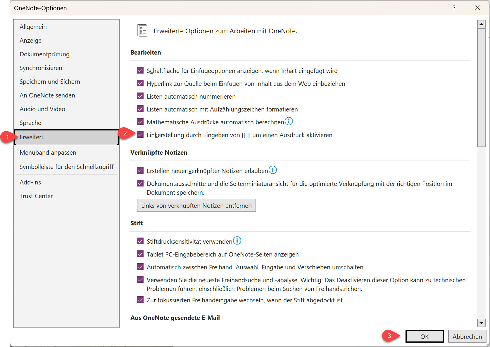

## Guide um PKM mit OneNote umzusetzen

Guide um PKM mit OneNote umzusetzen, falls geeignetere Tools (z.B. die aus Woche 2) nicht verfügbar sind, z.B. durch Einschränkungen seitens IT-Richtlinien in einer Firma

- \[\[SEITENNAME\]\] verwenden um direkt Links zu erstellen
  - in OneNote die Wiki Link Funktion artivieren

  - OneNote Wiki-Link anwendung

- alle Notizen in ein Notizbuch
- Register "MOC" könnte genutzt werden um alle MOCs zu Sammeln
- für jede Idee eine eigene Seite erstellen um gezielt verlinken zu können
- Sprechende Titel für Seitentitel verwenden

