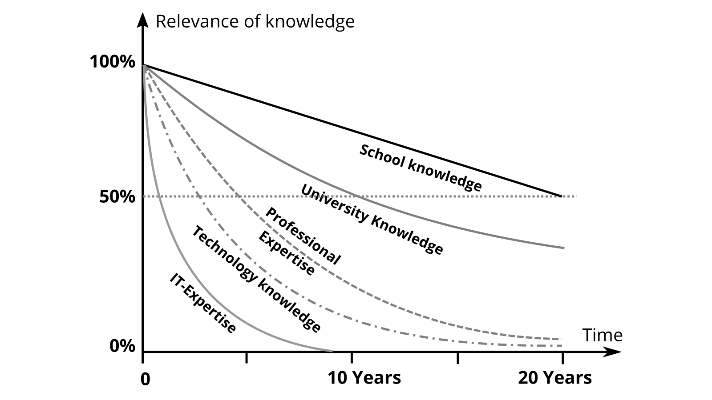

## Lifelong learning and knowledge work

We are currently in a very dynamic transition from an industrial to a [knowledge society](https://de.wikipedia.org/wiki/Wissensgesellschaft): Characteristic of this is that rules and norms are continuously questioned through learning processes (see also [Characteristics of the knowledge society](https://www.researchgate.net/publication/283061140_Merkmale_der_Wissensgesellschaft)).

In this society, we as individuals can actually only be successful through learning and contribute to the well-being of all together with others.

Author: geschmacksRaum®

Learning is the intentional or incidental acquisition of knowledge or skills. This learning process leads to relatively stable changes in behavior, thinking or feeling, based on experience or new knowledge.

In 1996, the [Delors Report](https://en.wikipedia.org/wiki/Delors_Report) of the European Commission drew an overall picture of lifelong learning ("learning throughout life") and named the four pillars that should be integrated into education and training in particular:

* **Learning to know** - a broad general knowledge with the possibility to deepen a small number of topics.
* **Learning to do** - to acquire not only professional skills, but also the competence to deal with many situations and to work in teams.
* **Learning to be** - to develop one's own personality and to be able to act with growing autonomy, judgment and personal responsibility.
* **Learning to live together** - by developing an understanding of other people and an appreciation of interdependence.

But there are also very practical reasons that make lifelong learning necessary for you. As you can see from the [half-life of knowledge](http://www.online-lehrbuch-bwl.de/lehrbuch/kap3/oe_le/oe_le.pdf) graph, some types of knowledge quickly become outdated, making continuous learning simply necessary. Even if areas such as school knowledge remain reasonably stable, the need to learn new things - especially in the technology and IT sectors - is particularly great.

For the citizens of a society, this means that even after completing their education through school and university, they should continue to learn in order not to lose touch. This learning process, which extends from birth to death, is referred to as lifelong or [lifelong learning](https://de.wikipedia.org/wiki/Lebenslanges_Lernen).

Until the first education, in most cases not only the parents but also the state take care of learning and education. After that, you have to [organize it for yourself](https://de.wikipedia.org/wiki/Selbstorganisation).

Author: Daniel Berkmann

### Knowledge work

In his book Landmarks of Tomorrow, Peter Drucker points to a change in the world of work toward knowledge-intensive work tasks, or [knowledge work](https://en.wikipedia.org/wiki/Knowledge_worker), as early as the late 1950s.
The knowledge worker is characterized by the fact that he knows better about the work task and the necessary knowledge than the managers of the organization, and therefore - in contrast to [Taylorism](https://de.wikipedia.org/wiki/Taylorismus) or [Scientific Management](https://de.wikipedia.org/wiki/Scientific_Management), in which there is a separation between head work and manual work - organizes himself to the greatest possible extent.

The organizational sociologist Hellmut Willke [defines knowledge work](https://www.researchgate.net/publication/41011087_Organisierte_Wissensarbeit) as activities such as communication, transaction and interaction, which are characterized by the fact that they require knowledge that has not been acquired once in life, for example through experience, initiation, teaching, specialized training or professionalization, and can then be continuously applied. Instead, it is precisely the knowledge that emerges in the lifelong learning process that is charaketistic and action-guiding for knowledge work. For this reason, relevant knowledge is not static, but should be

1. Continuously revised,
2. permanently regarded as capable of improvement
3. in principle not be regarded as truth, but as a resource, and
4. be inseparably coupled with non-knowledge.

Obviously, knowledge work involves risks, because what is valid today may already be invalid tomorrow.

The following activities are considered particularly knowledge-intensive, according to the study [Activities and occupational requirements in knowledge-intensive occupations](https://lit.bibb.de/vufind/Record/DS-131131):

* Research
* Developing
* Researching
* Documenting
* Training
* Teaching
* Organizing other people's workflows (yes, managers and executives are knowledge workers too :-)

If your workday consists largely of one or more of these activities, you can count yourself among the knowledge workers and you belong to the core target group of this guide.

Author: timothyh

### Productivity of knowledge work

Productivity](https://de.wikipedia.org/wiki/Produktivit%C3%A4t) is classically defined as the ratio of products produced to the factors of production required to produce them. Peter Drucker, in the book Management Challenges for the 21st Century, summarizes knowledge worker productivity in six factors:

1. knowledge worker productivity requires that the first thing we ask ourselves is **what is the task?**
2. knowledge work requires us to transfer responsibility for productivity to individual knowledge workers; to do this, we must give them the benefit of the doubt, because **knowledge workers must manage themselves.** To do this, there must be autonomous room for maneuver.
3. **Continuous innovation** is a part of the work that is the task and responsibility of knowledge workers.
4. knowledge work goes hand in hand with **continuous learning** on the one hand and **continuous teaching** by knowledge workers on the other hand.
5. the **productivity of the knowledge worker** is primarily not a question of the quantity of the results. The devil is often in the details, so quality is at least as important.
6. in conclusion, the productivity of knowledge workers requires that **knowledge workers are an "asset "** and not a "cost factor" and are treated accordingly. Knowledge workers are consequently especially productive when they want to work for the organization and do not choose one of the many elective options.

Dan Pink's well-received TED talk demonstrates precisely this connection of the importance of autonomy, continuous learning (mastery), and independent exploration or figuring out a relevant work task (purpose) that characterizes work in the 21st century [On the Surprising Science of Motivation](https://www.youtube.com/watch?v=rrkrvAUbU9Y).

