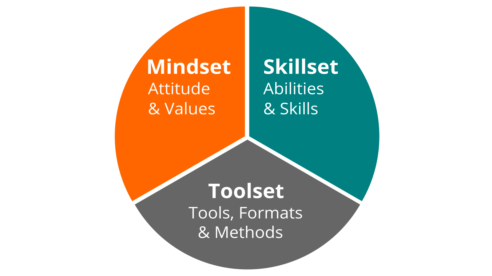
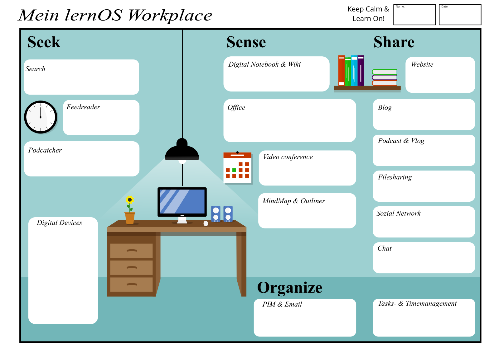

## lernOS Workplace - Your Learning Environment and Knowledge Workplace

When thinking of the modern learning and knowledge workplace, many immediately think of the "Digital Workplace" or the "Digital Classroom" with its many digital tools. That is why this chapter is preceded by the following quote:

> A fool with a tool is still a fool (Ron Weinstein)

Mindset, skillset & toolset instead of just toolset: When designing your own learning environment or knowledge workplace, it is important to take a balanced view of three areas:

* **Mindset** - What is my mindset towards learning and how does that show up in my learning environment/knowledge workplace (see also Growth Mindset by Carol Dweck, Open Mindset by Gary Hamel)?
* **Skillset** - how good are my competencies and skills related to learning (see also ([Framework for 21st Century Learning](http://www.p21.org/our-work/p21-framework), [DigiComp 2.1 Framework](https://ec.europa.eu/jrc/en/publication/eur-scientific-and-technical-research-reports/digcomp-21-digital-competence-framework-citizens-eight-proficiency-levels-and-examples-use))?
* **Toolset** - do I use contemporary tools, methods and formats in my learning and work processes (s.a. [Web 2.0](https://www.oreilly.com/pub/a/web2/archive/what-is-web-20.html), [Agile Methods](https://de.wikipedia.org/wiki/Agilit%C3%A4t_(Management)))?

Your **learnOS Workplace** is a very individual matter, so you should design it as well as possible according to your needs. As a rule, this place is not only in one place, but in several. For students, this can be the school and their own room, for example. In times of distributed and mobile work, any place can be your learning and working place.

With the following template based on the [Seek>Sense>Share Frameworks](https://jarche.com/2014/02/the-seek-sense-share-framework/) by Harold Jarche you can describe your current lernOS Workplace, share your thoughts about it and develop ideas for the future:

This also applies to the digital part of the personal learning environment: all learners have to choose and set up appropriate tools.

The following table shows examples of internal (intranet) and external (internet) tool examples for the individual categories of the lernOS Workplace:

| Tool Category | Description | Examples Internet | Examples Intranet |
| ---------------------------------------- | ------------------------------------------------------------ | ------------------------------------------------------------ | ------------------------------------------------------------ |
| **Search** | Bing, DuckDuckGo, Google | Microsoft Search |
| **Browser** | Chrome, Edge, Firefox | Chrome, Edge, Firefox |
| **Feedreader** | Subscribe and receive news in RSS or ATOM format | |
| **Podcatcher** | Subscribe, receive and listen to podcasts | Apple Podcasts App, Castro, Overcast | Microsoft Stream |
| **Digital Notebook** | Manage personal digital notes | Evernote | OneNote, Joplin |
| **Wiki** | Wikipedia, Fandom | Confluence, DokuWiki, MediaWiki |
| **Office Package** | G Suite, Collabra | Office 365, Libre Office |
| **Video Conferencing Software** | Conducting Audio and Video Conferences | Jitsi, Google Hangouts Meet, Skype | Zoom, GoToMeeting, Microsoft Teams, Skype for Business, WebEx, BlueJeans |
| **Mindmap Software & Outliner** | Creation and editing of hierarchical topic structures | Mindmeister | XMind, MindManager, Freemind, Freeplane |
| **Website** | Jimdo, Squarespace, Wordpress | SharePoint Online, Confluence |
| **Weblog** | Writing and publishing blog posts | Wordpress, Medium, LinkedIn (articles), Tumblr | HCL Connections, Jive, Yammer |
| **Podcast and Video Blog Platform** | Upload and Publish Audio and Video Blogs (vlogs) | YouTube, Vimeo, Podigee, Podcast Platform, Wordpress + Podlove | Microsoft Stream, Kaltura, Vimp |
| **Filesharing** | Organize files in folders | Dropbox, Google Drive | OneDrive, SharePoint Online, Nextcloud |
| **Social Networks & Online Forums** | Maintain Online Profile, Write Status Messages, Network with Others | LinkedIn, Twitter, Workplace by Facebook, Xing, ResearchGate, Reddit, Stackoverflow | Yammer, HCL Connections, Jive, Discourse |
| **Chat** | Write short messages, create chat groups | WhatsApp, Telegram, Signal, Threema, WeChat | Microsoft Teams, Kaizala, Slack, Mastodon, Threema, Mattermost, Rocket.Chat |
| **Personal Information Manager & Email** | Manage email, calendar, contacts etc. | Gmail | Outlook |
| **Task and Time Management** | Planning and keeping time for tasks | Trello, Todoist, Things, Omnifocus | Microsoft ToDo |
| **Reference Manager** | Link and Literature Management | Zotero, Mendeley, Liquidtext   
                                                              |

