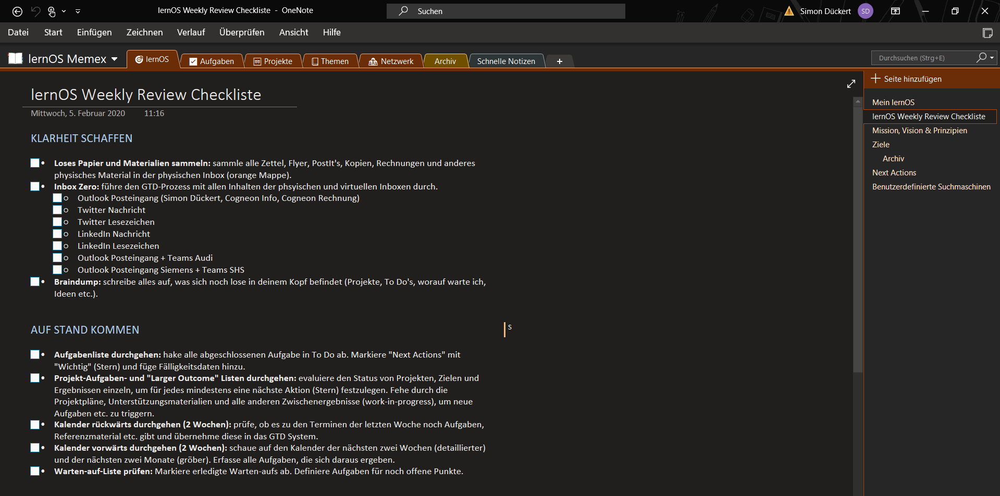

## lernOS Memex - the "2nd Brain" of the learners

The individual knowledge and learning environments are just as individual as every single person is. The idea of lernOS Memex aims to create a common reference point here. Memex stands for "Memory Extender" and can be understood as a digital twin of one's own brain, also called "second brain". So that is what this learning path is about among other things.

The Memex in lernOS is a system that the user trusts and which, in addition to all the organizational and planning elements of lernOS, also contains references and descriptions to all other systems used in lernOS practice.

Theoretically, the Memex can also be implemented in analog form, e.g., in the form of a notebook. In practice, however, digital notebooks or scratchpads are mostly used (e.g. Obsidian, Logseq, Roam), as they offer many advantages over analog variants. For example, they offer unlimited space, can be searched, and contain audio and video content. More on this in the learning path itself.

