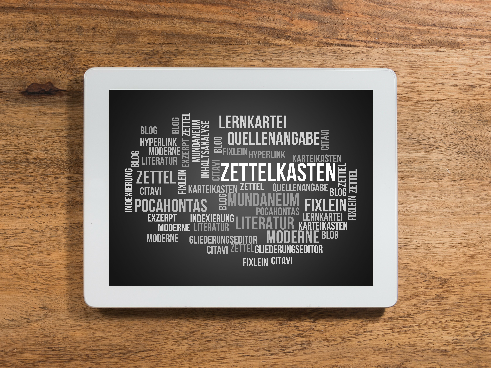

# Personal Knowledge Management Basics

In today's world, it is more important than ever to constantly acquire new knowledge and information. However, knowledge alone is not enough to be successful. It is just as important, if not more important, to think knowledge further in order to combine it into something new.
For example, to accomplish tasks and projects more efficiently, to adapt quickly to new demands and challenges, to better understand and pursue goals and plans, or to use study time more efficiently.
However, this is easier said than done. Fortunately, there are personal knowledge management methods that can help. One of these methods is the note box method.

The notebox method is based on a bottom-up topic structure and aims to put thoughts and ideas in one central place and connect them to each other in order to gain new insights, internalize knowledge and create sound texts. It may take a while to see the first results, but if you use the slip box method continuously, you will benefit from the rich harvest.

In order to use the note box method successfully, it is important to use it on a daily basis. Read and jot down your thoughts on what you read. Precisely formulate your notes and link your knowledge together. Connect your ideas and create overlapping connections. Ask yourself questions and try to answer them. Through this continuous thinking in the notebook, you will deepen your knowledge and generate new ideas.

In practice, the slip box method can be used in everyday work, study, and personal life. It can help to write well-founded articles, to make extensive thoughts tangible and to deepen your own knowledge. It is also helpful when writing articles, forum posts, social media posts, because you collect thoughts, prepare them and can insert them directly in an outline and have your contributions with depth already 90% ready.

Where the method can support you
- Professionally
	- It facilitates efficient and successful completion of tasks and projects.
	- It supports career development by helping to build and demonstrate relevant knowledge and skills.
	- It enables faster adaptation to new job demands and challenges.
	- It increases productivity and the ability to make decisions quickly.
	- It improves communication and collaboration within the organization.
- Private
	- It helps to better understand and follow one's goals and plans.
	- It supports self-organization and enables better management of time and tasks.
	- It promotes personal and intellectual development by helping to build new knowledge and skills.
	- It enables better management of finances and resources.
	- It increases the ability to solve problems and make decisions more quickly and effectively.
- In studies
	- It supports the understanding and retention of learning content and facilitates preparation for exams.
	- It promotes the development of self-learning strategies and the ability to acquire knowledge independently.
	- It enables more efficient use of study time and resources.
	- It promotes the ability to make connections between different subjects and disciplines.
	- It increases opportunities for successful career and professional development.

The slip box method was developed by sociologist Niklas Luhmann (\*8.12.1927), who was able to publish about 70 books and 400 articles with its help. And all of them of high quality. He used his slip box analog. What do you think he could have accomplished with a digital slip box? Find out what you can achieve!

## Links to further information on the subject of note boxes or personal knowledge management (PKM)
* [Niklas Luhmann explains how he works with his box of notes](https://youtu.be/qRSCKSPMuDc?t=2246) - 27:26 - 39:47
* [Niklas Luhmann's slip box - Gabriele Vollmar](https://youtu.be/gt6nRZQTYD4)
* [Vollmar - Personal knowledge management](https://www.wissen-kommunizieren.de/category/persoenliches-wissensmanagement/)
* [Niklas Luhmann - I don't think everything alone (note box as time memory)](https://youtu.be/NbncA7bDl70?t=18)
* [PKM - Harold Jarche](https://jarche.com/pkm/)
* [PKM Video - Harold Jarche](https://www.youtube.com/watch?v=HQbnoLxgx7I&ab_channel=HaroldJarche)

Autor/in: CrazyCloud

