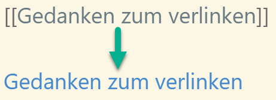

## Kata 7 - Create first notes

Used in [Week 3](2-1-Woche-3.md)

### Theory

Successful personal knowledge management in the notebook requires regular work. By taking time to regularly create and process notes, you can continuously increase your knowledge. Often it is enough to create a few, but regular notes. Every note, every linking of notes, and the thoughts that arise from them contribute to the increase of your knowledge. It is important to understand that knowledge management is a marathon and not a sprint, so you should also take time to take small steps.

To make note-taking easier and more energy-efficient, it's helpful to establish routines. You can do this, for example, by setting specific days or times when you create and process notes.

Fleeting notes, such as those created during a meeting or lecture, should be processed as quickly as possible to help you remember them later. The shorter the interval between the creation of the note and its processing, the better you can remember it later.

To create your first note in the note box, you can use the information from Week 3 (Getting to Know Notes). The topic of your first note is not that important, it should just be something that interests you but is not so important that it paralyzes you. It's perfectly fine to create multiple notes and link them - try it out and see how it works for you.

#### Tip
If you're unsure about what information to include in your Zettelkasten, you can check the information against the following criteria:
- the information speaks to me
- the information makes me think
- I need the information for a topic I am working on.
If necessary, look again at _week 3 - Getting to Know Notes_.

#### Tip 2
To create links in Mark-Down just put \[\[ \]\] around the note name and it becomes a link. Here you fan find more [MarkDown formating](3-0-1-was-ist-markdown.md).

### Exercises
- Create note(s)
	- Read an article/book/topic that you are currently interested in and create note(s) from it.
- Optional: set a rule date that goes beyond the sprint to process your cursory notes at a set time.
	- In addition to the sprint deadline, you can create another deadline for your Zettelkasten.

### Learning Objective
- You can create a note in your notebook that will still be understandable to you 10 years from now.
- You are now committed to meeting your rule deadlines.
- You regularly file notes in your note box.

