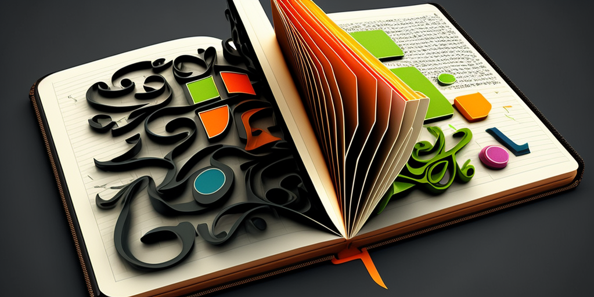

## Week 9 - Thinking in the Zettelkasten

Collecting notes is all well and good. Don't you feel like you have thoughts and questions about it?

### As preparation

- [ ] [Kata 14](2-1-Kata-14.md): Thinking in the Zettelkasten

### In the Weekly

- [ ] Check in (2 minutes per member)

What has been on your mind this past week related to personal knowledge management?

#### Guiding questions

- How did you feel about the dialogue with your Zettelkasten?
- What are the advantages of thinking in the Zettelkasten?
- How can you make objective comparisons between parallel and contradictory thoughts in the note box?
- How can you use the slip box as a conversation partner?
- What kinds of questions can I ask the Zettelkasten?
- How can I check the logic and reasoning in my conclusions?

### Close

- [ ] Check Out (1 minute per member)

What are your plans for next week?

