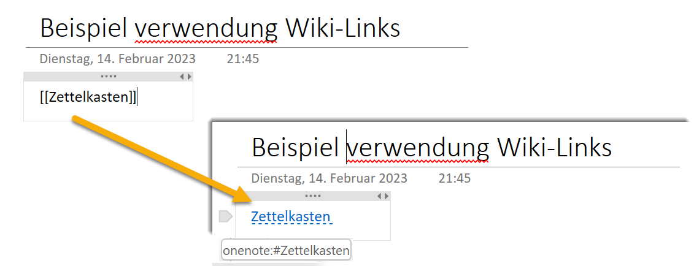

## Guide to implement PKM with OneNote

Guide to implement PKM with OneNote, if more suitable tools (e.g. those from week 2) are not available, e.g. due to restrictions from IT policies in a company.

- use \[\[PAGE NAME]\] to directly create links
  - enable the wiki link function in OneNote

  - OneNote wiki link application

- all notes into one notebook
- tab "MOC" could be used to collect all MOCs
- create a separate page for each idea to be able to link specifically
- Use speaking titles for page titles

