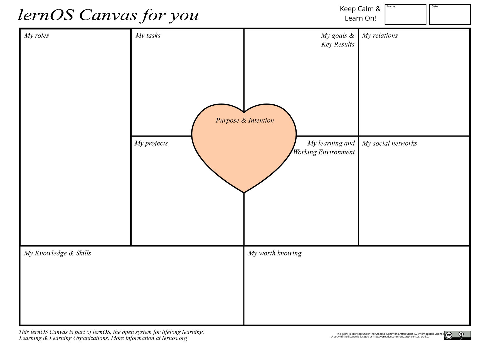

Author: Nali

## Your lernOS Canvas - Overview of knowledge and learning needs

With this canvas you can plan your learning and keep a good overview, so you don't forget anything important.
The visual structure also makes it easier for you to review the individual components that make up your current knowledge and learning needs and to match existing resources with your learning needs. A picture is worth a thousand words!
For example, you can use it to work on several areas at the same time.

Alex Osterwalder was the first to come up with the idea for a lernOS Canvas. He also developed the [Business Model Canvas (https://en.wikipedia.org/wiki/Business_Model_Canvas), which is used for the development of business models.
Both follow the same basic structure and should be filled out by you as a start. This way you get a suitable overview.
The [lernOS Canvas](https://raw.githubusercontent.com/cogneon/lernos-zettelkasten/main/en/src/images/lernOS-Canvas-for-you-Canvas-de.png)
**ProTip: Be flexible and work with sticky notes that you can use at any time as needed.

In the upper part of the canvas you can enter your name and the date of creation or last change. If you want to work with the canvas electronically, you can copy it e.g. into OneNote or a digital whiteboard. For the first filling of the Canvas, you can ask yourself the following questions, for example:

* **Purpose & Purpose:** What do you live for? What do you want to achieve in your life?
* **Goals & Key Results:** What are your goals for the next 12 weeks? What are the measurable outcomes to the goals?
* **My Roles:** What are your current roles? What are the goals that flow from them?
* **My Tasks:** What are your current tasks? What are the goals that result from them?
* **My Projects:** What are your current projects? What are the goals that result from these?
* **My Social Networks:** What internal and external social networks (digital and analog) help you network?
* **My Learning and Working Environment:** What does your learning and working environment look like (infrastructure, content, tools, methods, etc.)?
* **My Knowledge & Skills:** What knowledge areas and skills are important to your goals, roles, tasks, and projects? What do you still need to learn?
* **My Knowledge Assets:** What knowledge assets (documents, checklists, videos, etc.) do you have? Which of these can you offer to your network?

