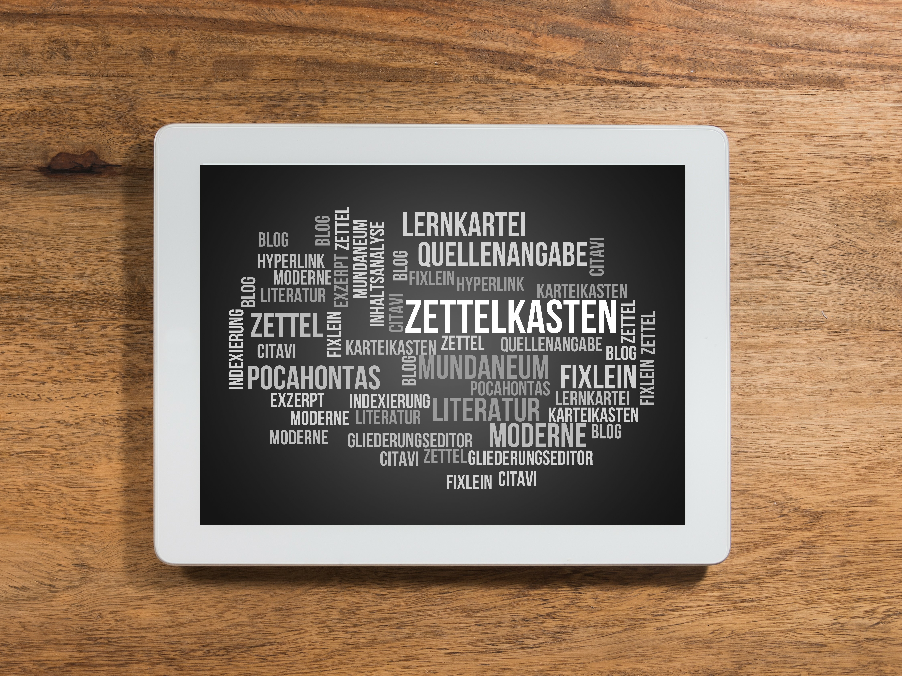

# Persönliches Wissensmanagement Grundlagen

In der heutigen Zeit ist es wichtiger denn je, ständig neues Wissen und Informationen zu erlangen. Wissen alleine reicht jedoch nicht aus, um erfolgreich zu sein. Es ist ebenso wichtig, wenn nicht sogar wichtiger Wissen weiter zu denken, um es zu etwas Neuem zu verbinden.
z.B. um Aufgaben und Projekte effizienter zu erfüllen, sich schnell an neue Anforderungen und Herausforderungen anzupassen, Ziele und Pläne besser zu verstehen und zu verfolgen oder die Studienzeit effizienter zu nutzen.
Das ist jedoch leichter gesagt als getan. Glücklicherweise gibt es Methoden des persönlichen Wissensmanagements, die dabei helfen können. Eine dieser Methoden ist die Zettelkasten-Methode.

Die Zettelkasten-Methode basiert auf einer Bottom-Up Themenstruktur und hat das Ziel, Gedanken und Ideen an einem zentralen Ort abzulegen und diese miteinander zu verbinden, um neue Erkenntnisse zu gewinnen, Wissen zu internalisieren und fundierte Texte entstehen zu lassen. Es kann eine Weile dauern, bis man die ersten Erfolge sieht, doch wenn man die Zettelkasten-Methode kontinuierlich anwendet, wird man von der reichen Ernte profitieren.

Um die Zettelkasten-Methode erfolgreich anzuwenden, ist es wichtig, sie täglich zu nutzen. Lies und notiere deine Gedanken zum gelesenem. Formuliere deine Notizen präzise aus und verknüpfe dein Wissen miteinander. Verbinde deine Ideen und schaffe übergreifende Verbindungen. Stelle dir selbst Fragen und versuche diese zu beantworten. Durch dieses kontinuierliche Denken im Zettelkasten wirst du dein Wissen vertiefen und neue Ideen generieren.

In der Praxis kann die Zettelkasten-Methode sowohl im Berufsalltag als auch im Studium und im privaten Bereich eingesetzt werden. Sie kann dazu beitragen, fundierte Beiträge zu schreiben, umfangreiche Gedanken greifbar zu machen und das eigene Wissen zu vertiefen. Sie ist auch beim Schreiben von Artikeln, Forum-Beiträge, Social-Media Beiträge hilfreich, denn du sammelst Gedanken, bereitest sie auf und kannst sie in einem Outline direkt einfügen und hast deine Beiträge mit Tiefgang bereits zu 90% fertig.

Wobei die Methode dich unterstützen kann
- Beruflich
	- Es erleichtert die effiziente und erfolgreiche Erfüllung von Aufgaben und Projekten.
	- Es unterstützt die Karriereentwicklung, indem es dabei hilft, relevantes Wissen und Fähigkeiten aufzubauen und zu demonstrieren.
	- Es ermöglicht eine schnellere Anpassung an neue Anforderungen und Herausforderungen im Beruf.
	- Es erhöht die Produktivität und die Fähigkeit, schnell Entscheidungen zu treffen.
	- Es verbessert die Kommunikation und Zusammenarbeit innerhalb des Unternehmens.
- Privat
	- Es hilft dabei, die eigenen Ziele und Pläne besser zu verstehen und zu verfolgen.
	- Es unterstützt die Selbstorganisation und ermöglicht eine bessere Verwaltung von Zeit und Aufgaben.
	- Es fördert die persönliche und intellektuelle Entwicklung, indem es dabei hilft, neues Wissen und Fähigkeiten aufzubauen.
	- Es ermöglicht eine bessere Verwaltung von Finanzen und Ressourcen.
	- Es erhöht die Fähigkeit, schneller und effektiver Probleme zu lösen und Entscheidungen zu treffen.
- Im Studium
	- Es unterstützt das Verstehen und Behalten von Lerninhalten und erleichtert die Vorbereitung auf Prüfungen.
	- Es fördert die Entwicklung von Selbstlernstrategien und die Fähigkeit, sich selbstständig Wissen anzueignen.
	- Es ermöglicht eine effizientere Nutzung der Studienzeit und Ressourcen.
	- Es fördert die Fähigkeit, Zusammenhänge zwischen verschiedenen Fächern und Disziplinen herzustellen.
	- Es erhöht die Möglichkeiten für eine erfolgreiche Karriere und berufliche Entwicklung.

Die Zettelkasten-Methode wurde vom Soziologen Niklas Luhmann (\*8.12.1927) entwickelt, der mit ihrer Hilfe ca. 70 Bücher und 400 Artikel publizieren konnte. Und alle von hoher Qualität. Er hat seinen Zettelkasten analog benutzt. Was hätte er wohl mit einem digitalen Zettelkasten erreichen können? Finde heraus, was du erreichen kannst!

## Links zu weiteren Informationen über das Thema Zettelkasten oder auch Persönliches Wissensmanagement (PKM)
* [Niklas Luhmann erläutert wie er mit seinem Zettelkasten arbeitet](https://youtu.be/qRSCKSPMuDc?t=2246) - 27:26 - 39:47
* https://youtu.be/gt6nRZQTYD4
* https://www.wissen-kommunizieren.de/category/persoenliches-wissensmanagement/
* [Niklas Luhmann - Ich denke ja nicht alles allein (Zettelkasten als Zeitgedächtnis)](https://youtu.be/NbncA7bDl70?t=18)
* PKM - Harold Jarche: https://jarche.com/pkm/
* PKM Video: https://www.youtube.com/watch?v=HQbnoLxgx7I&ab_channel=HaroldJarche

Autor/in: CrazyCloud

