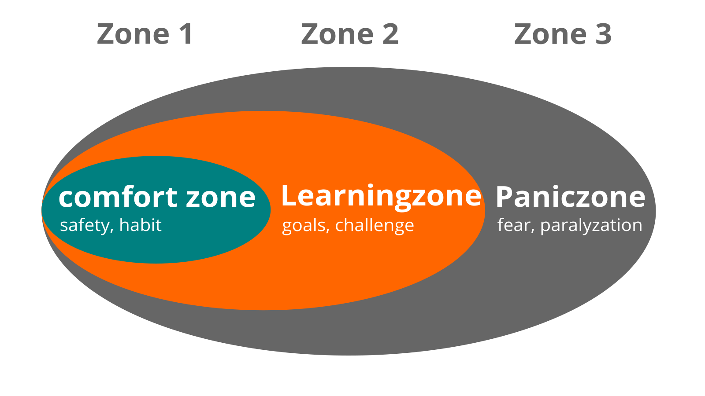

## Week 1 - Goal definition & appointment with yourself

Week 1 is the only week that consists of two topics. Your goal definition and making an appointment with yourself.

### Goal definition

#### Theory
What do you want to achieve in the next twelve weeks? You can choose a goal that is really, really important to you and with which you will make very concrete progress during the sprint. However, especially for PKM beginners, achieving the goal is not the top priority. In addition to learning the basic knowledge, the environment, the findability and permanence of notes, the focus is still very much on regularly applying the newly gained skills.
In particular and last but not least, one main thing is our focus: having a lot of fun! :D

To ensure optimal learning success, it is important to set goals that motivate you and make your progress tangible and visible. You'll want to set your goals using the SMART formula or use Google's OKR method^[links in the "More Information" section] to define your goal. Consider whether you might want to work toward a specific product. This could be, for example, a blog article for your co-workers, or a first publication, or, or, or....
Visualize your goal. For this purpose, you can use different technical tools on the Internet.  

Think about how you will share your progress in the Circle. In other words, if your first priority is to check-in, that's a bit low. Consider what documentation tools are out there that are good for logging your progress.

###### Define goals using the SMART formula.

Autor: Dmitry

Using the SMART method is a good way to define a goal. It applies various criteria against which the goal definition is measured. This way you have the guarantee to reach a smart goal.

**S**pecific: Is it really clear what you want to do, or are you perhaps too vague in your wording? What is included, and especially what is not? Only if you really know exactly what you want to do and at the same time know the limits of your intention, you can set out and be sure that you will arrive on the way in any case without getting bogged down or even losing your orientation.

**M**essbar: What must have happened so that you can say that your goal has been achieved. What work result is there then? For example, if you want to get "better" at something, what do you need to do and how often to get enough practice? Formulate in such a conclusive and measurable way that you can achieve just that. Essentially, ask yourself what you want to get better at or what exactly this "better" can be tied to. Characterize the first point, because the more specific you are in defining your goal, the more likely you are to get a result that meets your expectations, that can be further improved, and that can be markedly evaluated.

**A**ttractive: Your goal must motivate you. You must want to achieve it if you want to spend 12 weeks to make it come true. Therefore, this point is especially important. It should be a goal that you have personally chosen for yourself and with which you can identify 100%. A goal that others set for me will rarely trigger the same desire in me to achieve it as one that springs from my own heart. In some explanations of the SMART formula, the A also stands for **A**nchallenging. Will mean that your goal should not be too easy. You should make a little effort and challenge yourself, because if you stay too far away from your personal limits and actually still chill in your comfort zone, you can rarely really improve. Ultimately, you need to go a little beyond your comfort zone without completely overtaxing yourself, because that's where growth begins.
Caution. Overextending yourself won't yield sustainable results, and by and large, this learning path is meant to bring one thing above all else: a lot of fun! And that can quickly fall by the wayside if your goals are too ambitious.

**R**ealistic: The learning path goes 12 weeks and therefore you should also choose a goal that is really achievable in this time. Stay down to earth when defining your goals. You can achieve anything at a snail's pace and with perseverance. It is also key to question yourself in advance:
Are you one of those people who like to choose their goals a little more challenging?
How much time do you really have available each week?
Does the whole thing really fit into the framework of the 12 weeks of the Learning Sprint?
If it has to be, then say goodbye to one or the other idea for the time being. Ultimately, the first sprint is good training that will eventually become second nature. The current learning sprint may only have been a prelude. :-)

**T**erminated: Another important requirement of your goal that you should pay attention to is the date of completion.
In the context of the learning sprint, this date can actually be determined very precisely. And that's important, too, because it gives you the opportunity to check whether you're still on track in terms of deliverables, open items, and any problems or obstacles, or whether you might need to put more energy into your work on the project or conclusively scale down your goal in order to achieve it at all.
In week 7 we will look at the first interim results. A good moment to look at your own goal again from the SMART perspective and if necessary to readjust it a bit.

**Example of goal setting with OKRs**.

As easy as the card box is to explain, as challenging it can be to work with it at the beginning. For this reason, we recommend setting a concrete goal and possibly starting with a small project. To make this a little more concrete, here is an example.

Nima has started to study wants to work in science in the future, so clean scientific work and the corresponding writing organization should be practiced from the beginning.

Nima's goal for week 12 in the notebox learning path is to develop a routine in using the notebox. Therefore, Nima is considering working on this very routine with an upcoming term paper. For starters, it is very challenging to write 15 pages from the note box, so it makes sense to define even more key outcomes.

The question that can help you to define the Key Results is: How do I know that I am getting closer to my Objective?

1st Key Result: The key result that is obvious is the 15 pages written.
2nd Key Result: Nima has developed a complete workflow. This includes a reading routine, transferring notes to permanent notes, linking thoughts,....

**Additional Information.

- Wikipedia article [SMART Criteria](https://en.wikipedia.org/wiki/SMART_criteria) (English).
- MIT Sloan article [With Goals, FAST Beats SMART](https://sloanreview.mit.edu/article/with-goals-fast-beats-smart) (English)
- Article [OKR - Google's Wonder Weapon for Business Success or: Get Out of the Comfort Zone](https://t3n.de/news/okr-google-wunderwaffe-valley-ziele-530092/) (German)
- Ted Talk [How We Can Make the World a Better Place by 2030](https://www.youtube.com/watch?v=o08ykAqLOxk) (English)
- Video How Google Sets Goals: [OKRs with Google Ventures Partner Rick Klau](https://www.youtube.com/watch?v=mJB83EZtAjc) (English)
- Video [OKR-Agile Goal Management for Medium-Sized Businesses](https://www.youtube.com/watch?v=_ugCKONbBNs) (german)
- Video [OKR - Leading with Objectives and Key Results (OKRs) - how the Google Leadership System works](https://www.youtube.com/watch?v=y-aIyqMZfnE&t=) (german)
- Book [Introduction To OKRs by Christina Wodtke](https://www.oreilly.com/business/free/files/introduction-to-okrs.pdf) (english)
- Book [The Beginner's Guide To OKR by Felipe Castro](https://felipecastro.com/resource/The-Beginners-Guide-to-OKR.pdf) (english)

#### exercises
- Using a method of your choice, define your goal(s) for this learning sprint.
- Share your goal(s) with the Circle

#### Reflection part
What is already going well?
What have you already achieved?
Who/what could support you?
How would you know that you have fully achieved your goal?

#### Learning goal
- You support your learning success by making your goals measurable.
- You motivate yourself and the other participants by making your goals tangible.

### An appointment with yourself

#### Theory
Do you take enough time for your personal development and to work on your goals? Many people are busy with their daily tasks and don't care enough about their development and well-being. A good approach is to make an appointment with yourself and reserve this time in your calendar.

##### More information:

-   Video: [7 Big Rocks](https://www.youtube.com/watch?v=fmV0gXpXwDU)
-   Podcast: [Never enough time? Schedule your priorities by colorcoding your calendars](http://www.asianefficiency.com/schedule-management/color-code-your-calendar/)

#### exercises

Check your calendar and look for possible dates with yourself. An hour or even 30 minutes a week is a good starting point. Put an appointment with yourself on the calendar. If possible, make it a recurring appointment so that this time becomes a habit for you. Find at least five appointments:

1. ...

2. ...

3. ...

4. ...

5. ...

#### Reflection part
- Discuss your approaches in the Circle.
- Do you have the same time slot each week?
- Do you find it easier to dynamically schedule an hour each week?
- How do you usually schedule recurring appointments and do you feel comfortable with the method?

#### Learning Goal

- You make a commitment to yourself to give yourself this learning space for the exercises.
- You create the necessary conditions to carry out the Circle successfully.

