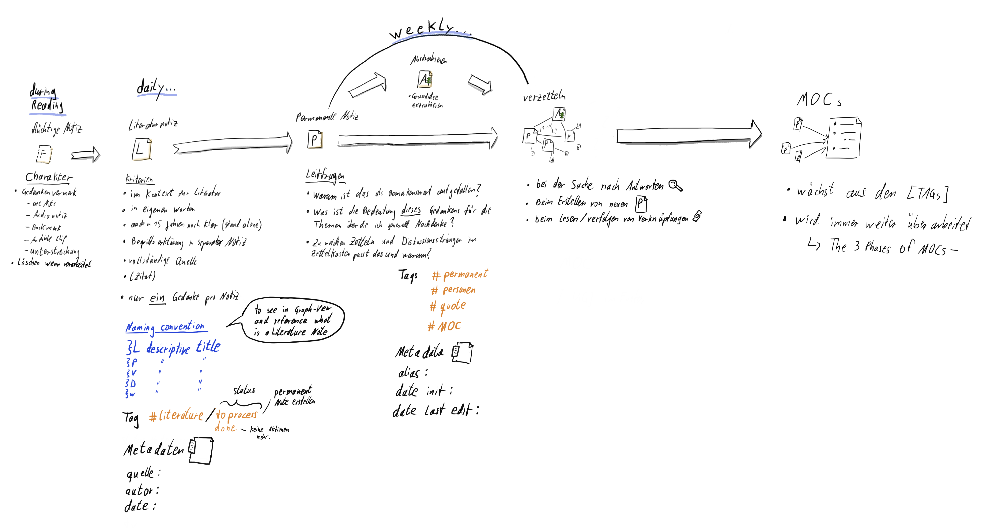
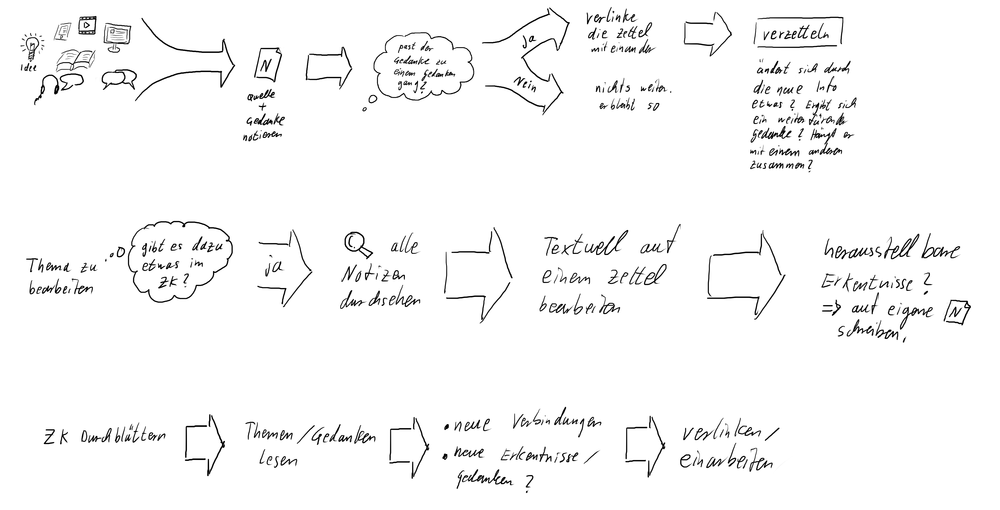
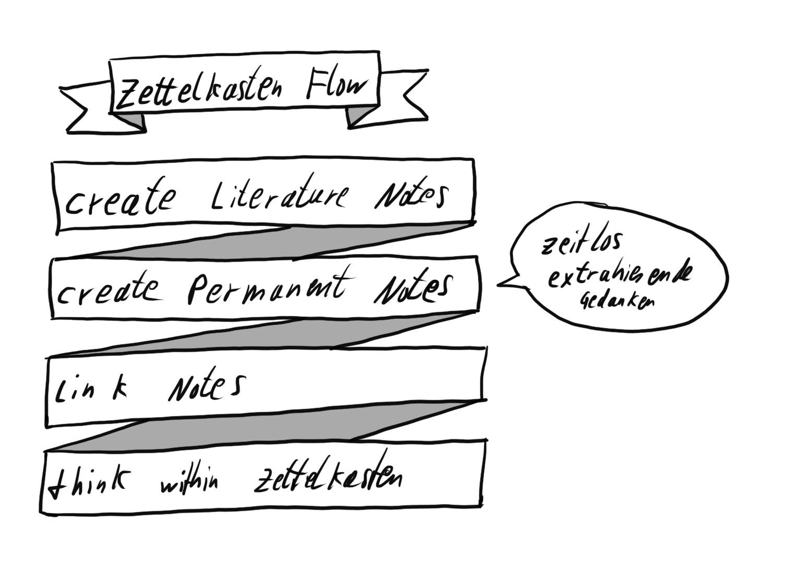
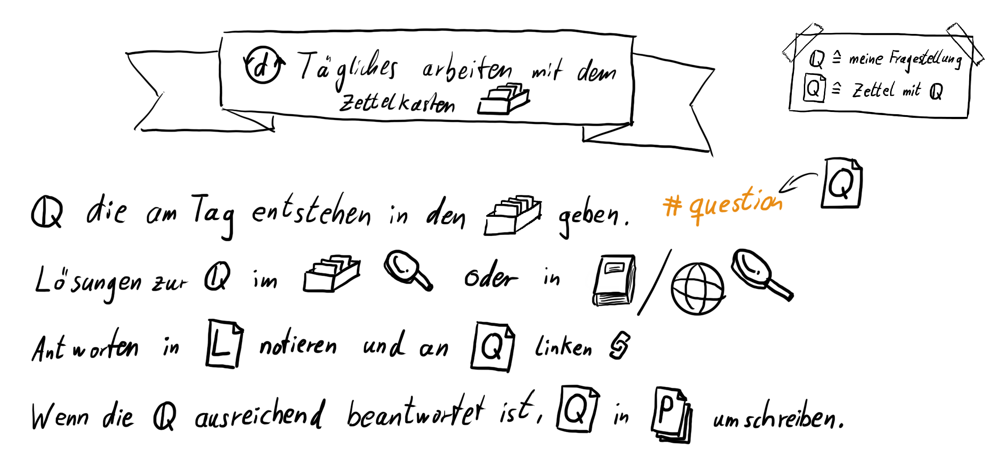

## Kata 15 - Find your workflow

Used in [Week 4](2-1-Woche-4.md)

### Theory
A workflow is of great benefit in staying on task and working more effectively. An established workflow helps to find a habit, use time more effectively, avoid distractions and focus on the task at hand. Habits require less energy and allow you to constantly optimize your work process. A Zettelkasten workflow should include steps such as collecting notes, processing notes, writing permanent notes, creating Map Of Contents, and thinking in the Zettelkasten. When thinking in the Zettelkasten, you should ask questions, find answers, generate new ideas, work systematically with the Zettelkasten, and connect knowledge systematically. To establish a workflow, you should first define a goal, list the tools you use, and put the steps in order. The steps and tools should be connected and the workflow should be reviewed and adjusted regularly to keep it up to date. A workflow stays alive if it is executed, reviewed and adjusted on a regular basis. Regularity in execution and review is important to ensure it is still current and meets your needs. Adjustments should therefore be made regularly to keep it up to date.

Here are sample workflows to inspire you. Everything is allowed, so you can have completely different entry points.

#### Workflow 1

#### Workflow 2

#### Workflow 3

#### Workflow 4

#### Workflow 5

### Exercises

You can describe the workflow with bullet points, in a bulleted list, pull up boxes in PowerPoint, or otherwise describe a workflow. Use whatever you feel most comfortable with.

- Think about creating one big workflow or several smaller ones for different areas.
	- e.g. collecting notes; distracting; thinking; writing texts
- define your goal, what the workflow should help you with
- write down which tools you use for working with your note box
	- note-taking environment
	- digital readers and utilities
	- list interfaces between tools
	- Books, ruler, markers, college block, etc.
- Create a rough flowchart that includes the steps you will take in the Zettelkasten process
- Add to the steps the tools you will need
- Check if you see potential for optimization in the flowchart
- Add details if they seem necessary to you

### Learning Objective
- Recognized that a good workflow is critical for lasting success.
- Understood that a notepad only comes into its own when it is continuously in use.
- You have your own workflow

