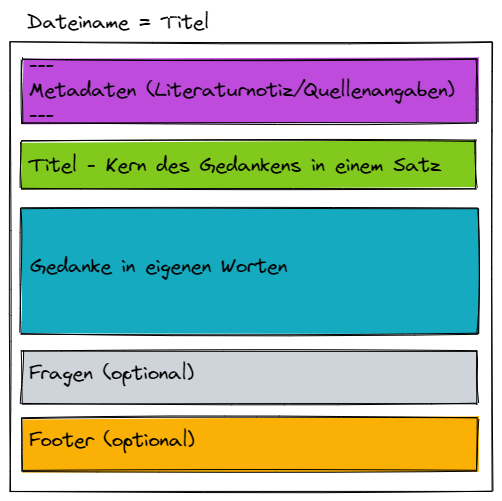
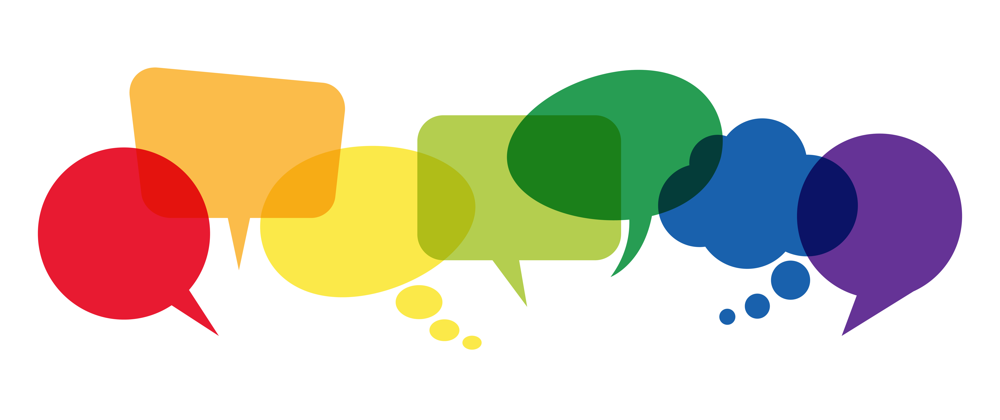

## Week 3 - Get to know notes

### Theory/questions

#### Types of notes
It is not mandatory to use the terms, and the types can overlap and blend into each other. Just think of it as helpful background knowledge to guide you, and keep an open mind and flexibility in the application itself. The notebox is a living system and so it adapts to you.

##### cursory notes
When you read a text and underline, mark up, write a few notes in the margin, or even write down notes while listening to it, these are ephemeral notes. Fleeting because usually after a few hours, after a few days you can no longer quite grasp the meaning of your underlining, key points or have completely forgotten. Maybe you have experienced this in school when you wanted to prepare for a class assignment and went through your notes ;-)

##### Literature Notes
The literature note, or bibliographic note, is the reference to the source of the information. The purpose of the bibliographic note is to record the source of the information. Depending on what you expect of yourself, you may want to include more or less information. If you are working scientifically, you will need to include more information, as there are usually general guidelines for this, which we will not go into here. Apart from that, you should always note down the following information
- author
- Book title/Internet link
- date of publication

##### Permanent notes
Your thoughts about the information are in the Permanent Notes. Every note you put in your notebox is meant to stay in your notebox forever. Hence permanent. It is irrelevant if you keep rewriting the note with the newest information or if you create new notes with new information and link them.

##### Map of Contents / Index
Map of Content or Index notes are entry points on a higher level. Later we will come to how such notes are created. Here it is only about the fact that you already know that such a thing exists. When you have a lot of notes in your system, you will need a method to find your thoughts when you need them. And that's where these Map Of Contents help. By the way, there can be several levels of them, depending on how extensive your thoughts on a topic are.

#### Structure - DNA of a note
A structure for notes? Since it is not enough to simply record the thought, but it needs to be coherently "taken in hand" in order to creatively stand in (d)context, there is a structure for this. The thought itself is certainly the most important thing in the whole, ultimately it comes from a context and is thought in a new one. Directly following this is the retrievability of the thought. On the one hand you have to grasp it quickly and on the other hand this only happens if you follow the always same structure of the note. This way your brain has accordingly the capacities it needs free to actually grasp the information dynamically. The recognition effect that is in the DNA of your note can actually serve you well....

You can use your own structure. Maybe you already have one you feel comfortable with and want to keep using it. That's perfectly fine. You can also create one according to your own ideas. The important thing is that you stay consistent with it. Changes over time are natural with increasing knowledge. But you should not reinvent your structure every week or even every note ;-)

Here is a suggestion for a structure

##### Metadata
Here you can enter information like author, source, date, tags and alias. With most PKM programs this information can also be searched and displayed selectively. Thus, the information of the literature note can also be embedded in the metadata.

##### Title
Each note needs also a title with which it can be identified unambiguously.

##### Thought
Here is the actual note. The thought you have. Knowledge, thoughts, conclusions, what you have in your head.

##### Questions
If you ask yourself questions about the thought, you can put them in an extra questions section. This way you can always find your unanswered questions immediately.

##### Footer
In the footer could be links to other relevant notes that are not in the text, but still have a relevance to the topic. The source, the literature noitz, could also be placed here.

#### Note in your own words
If you can reproduce a thought in your own words, then you have understood the thought. In essence, you can check whether you have acquired the knowledge or not. If you express the thought in your own words and can't find the right words for it, you realize that you didn't understand it after all or maybe you need to practice to improve your performance. If you can express it in your own words, you will already use your own linguistic (or visual) meta-model. All this will most likely guarantee that in a few years you will still be able to express the idea and that it will be understood. This topic will be discussed again in detail in the kata _Creating durable notes_.

Autor/in: PicoStudio

#### Progressive Summarization

Progressive Summarization is a technique to summarize a text in iterative steps and reduce it to the essentials.
Ideally, 10% text remains after each iteration.

Step 1: the complete text excerpt from a source
Step 2: underline or mark in bold the most important statements/sentences of the text
Stage 3: From the underlined/bold marked the most important keywords Angemarkert that are important for the statement.
Level 4: A summary in your own words
Stage 5: Bounding

In this process, the original text remains available at all times. If a higher level is not understood, the level below can be read. The method acts much like a safety net.
Also, the method can still be used well when not so much energy is available.
The method is a method, it does not have to be used. You can also record what you have read, heard or seen directly as audio, thereby increasing your social presence within a learning group, or reproduce it in your own words in a timely manner.

### Tasks/Exercises
- Write down your questions about what you have written above
- Discuss your understanding on notes and clarify the questions everyone has

### Reflection part
- Do you feel picked up or unsettled with the information above?

### Learning Objective
- What a note should include at a minimum
- What is optionally helpful in a note
- Self-check if the knowledge was understood
- Identify essential statements from texts
- Different types of notes and their meaning
