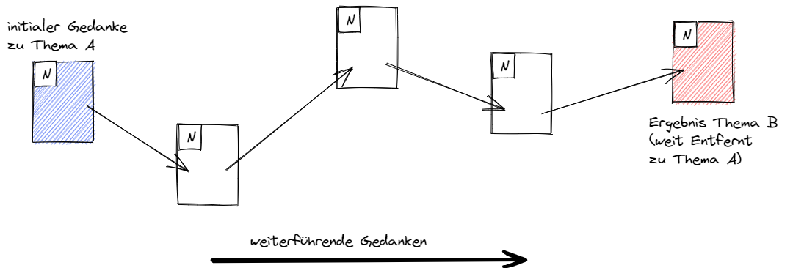
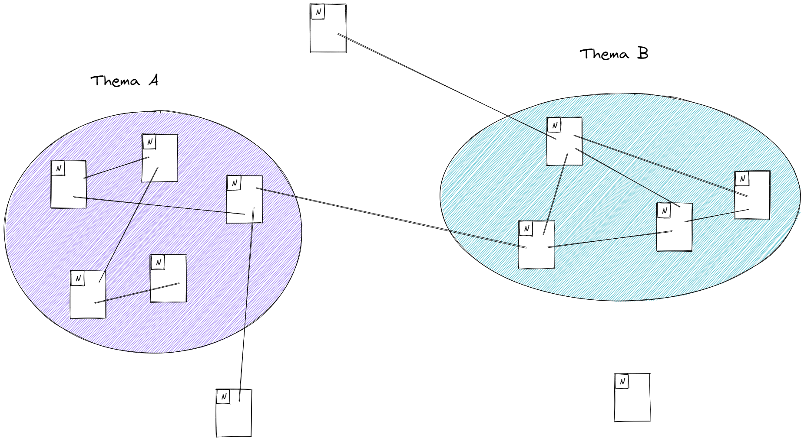

## Woche 6 - Verzetteln

### Theory/questions
We start at one thought and move sequentially from there to the next thought. In the end, we have come from one starting point to a completely different point by chaining.

The same thing happens now with linking notes. A thought starts in a note, which leads to another thought (note), and on and on. This is a fundamental aspect of dovetailing, connecting information that has to do with each other.

From this connecting of information, clusters of topics emerge. This is what is meant by bottom-up in this context. Areas/topics are not defined in advance, but the topics are formed by the accumulation of knowledge and networking with each other to form topic areas.

Thus, branching not only creates topic clusters, but also natural entry points for topics. Connections _grow_ between topics that were not known before. This can lead to new ideas or even completely new approaches: something new emerges. In this way, your knowledge connects itself in your own note box just as it is laid out in the neuronal structure of your brain, and in the process it sinks in deeper and deeper.

A piece of information is most likely to be found when there are many links on it. This is predetermined by the system of the brain. You use this when you create your note. Therefore, linking relevant information increases the findability and memorability of the information. Note-taking is also important for this. It keeps the information in the Zettelkasten together and makes it accessible so that you can think and work with it on a deeper level (your long-term memory).

It is worth mentioning that the more notes you have in your Zettelkasten, the more important and clear it becomes. Even if you have only a few notes in your notebook, it is worth starting now and repeating them continuously. In total, your notebook will grow on the one hand and the knowledge will be retained or deepened on the other.

### Tasks/Exercises
In the last kata you already made notes more atomic, so now you can grasp the idea of the note more quickly.

Go through the notes in your note box and if you notice that two ideas belong together, can look out for each other, or are otherwise connected, link them together.

If questions come to mind as you read the note, look for answers in your Zettelkasten and link them if you find notes that match.

Break down other notes into smaller components, linking to them as you get the sense that they should be related.

You can also link directly to other notes that you know are related when you add permanent notes.

You can put the link in the Footer^[The bottom area of a note] area, or you can link inline^[Insert directly into the text or sentence].

And keep in mind, a link is not only to the same topics, but can also be a completely new link, just the one you see.
You could also create a new note explaining for yourself why you see a connection between the two notes.

### Reflection section
- Would you do things differently the next time you get bogged down than you did this time?
	- Why - What is good about what you have done so far?
	        - What would you do differently next time?
		- What specifically could help you do this?
- Are you satisfied with the result?

### Learning goal
- When working with the knowledge, associations with other knowledge arise and the two are linked together
- Topic clusters emerge all by themselves
- Unknown references to completely different areas emerge.
