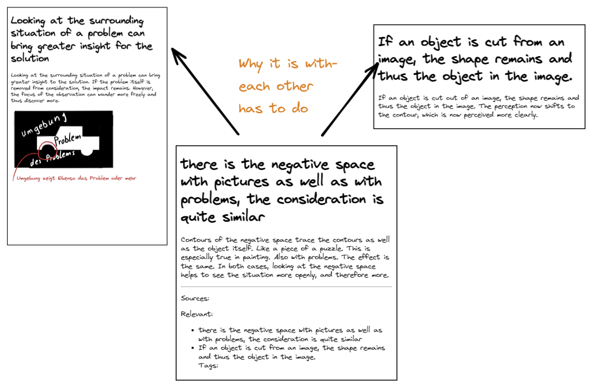

## Kata 9 - Frittering

Used in [Week 6](2-1-Woche-6.md)

### Theory
We start at one thought and move sequentially from there to the next thought. In the end, we have come from one starting point to a completely different point by chaining.

The same thing happens now with linking notes. A thought starts in a note, which leads to another thought (note), and on and on. This is a fundamental aspect of dovetailing, connecting information that has to do with each other.

From this connecting of information, clusters of topics emerge. This is what is meant by bottom-up in this context. Areas/topics are not defined in advance, but the topics are formed by the accumulation of knowledge and networking with each other to form topic areas.

Thus, not only topic clusters but also natural entry points for topics are created by the divergence. Connections _grow_ between topics that were not known before. This can lead to new ideas or even completely new approaches: something new emerges. In this way, your knowledge connects in your own notebook just as it is laid out in the neuronal structure of your brain, and in the process it sinks in deeper and deeper.

A piece of information is best found when there are many links on it. This is predetermined by the brain's system. You use this when you create your note. Therefore, linking relevant information increases the findability and memorability of the information. Note-taking is also important for this. It keeps the information in the Zettelkasten together and makes it accessible so that you can think and work with it on a deeper level (your long-term memory).

The more notes you have in your box, the more important and clear it becomes. Even if you only have a few notes in your Zettelkasten, it's worth starting now so that it grows. This way you will save knowledge and deepen it at the same time.

### Exercises
In the last kata, you already made notes more atomic, so now you can capture the idea of the note more quickly.

Go through the notes in your Zettelkasten and if you notice that two ideas belong together, can look out for each other, or are otherwise connected, link them together.

If questions come to mind as you read the note, look for answers in your Zettelkasten and link them if you find notes that match.

Break down other notes into smaller components (keyword atomicity, from [Kata 8](2-1-Kata-8.md)), linking them as you go, as soon as you get the impression that they should be related.

You can also create direct links to other notes that you know are related when adding permanent notes.

You can put the link in the Footer^[The bottom area of a note] area, or you can link inline^[Insert directly into the text or sentence].

And keep in mind, a link is not only to the same topics, but can also be a completely new link, just the one you see.
You could also create a new note explaining for yourself why you see a connection between the two notes. The following image illustrates this.

Note: If you are working a lot and intensively on a topic, it might make sense to set up an additional time per week where you only focus on linking ideas to each other. Tags like they exist in Obisidian can be helpful to link not yet linked notes.

### Learning goal
- You have received new associations and made connections
- You have formed new topic clusters

