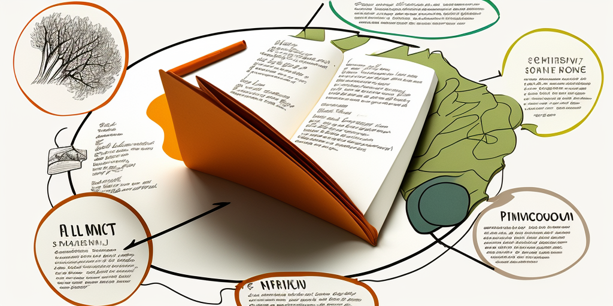

## Week 2 - Getting to know notes

Notes, we all know. Here we will look at their structure and content, what they are for knowledge management.

### As preparation

- [ ] [Kata 5](2-1-Kata-5.md): get to know _notes_

- [ ] [Kata 6](2-1-Kata-6.md): Read the Progressive Summarization method and try it out on an article/website.

### In the Weekly

- [ ] Check in (2 minutes per member)

What has been on your mind in the last week related to personal knowledge management?

#### Guiding questions

- Is a uniform structure beneficial or unnecessary?
- Progressive Summarization or directly summarizing in your own words?
- Do you feel picked up or confused with the information in the katas?
- Does Progressive Summarization help you to work out the essential parts of a text?
- Have you been able to implement about 10% of the previous layer per level?
- Would you use Progressive Summarization, use it once in a while, not use it at all? Why?

### Close

- [ ] Check Out (1 minute per member)

What are your plans for next week?

