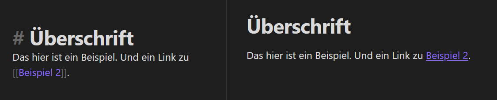

# Appendix

## What is Mark-Down?

Markdown is a markup language. This means that control characters are used in the text to indicate how the text should be displayed. So the control characters really go directly into the text. It could be compared to HTML^[Web pages are described with HTML] or LaTeX^[A markup language used especially in science]. But don't worry, you don't have to program here, very few characters are enough and the programs then display the text without the control characters.
To give you an idea of what this is all about, here is a practical example.

On the left is the text with the formatting characters. On the left is what you then see in the display.

The big advantage is that they are all text files (like the .txt extension you sometimes see on your computer). So they are readable on any system. The extension .md says only that syntax for interpretation is included in the format mark-down.

### Control characters

Already with two control characters the text can be brought into a structure and notes can be connected with each other.

- \#, \##, \###, ...., For overwritings
	- \# first hierarchical level
	- \# second hierarchical level
	- \#\# third hierarchical level etc.
- \[_note-name_]] to create links to other notes --> branching

That's basically all you need to get started.

Here are a few more control characters that are very handy, but not necessary. Just use the ones you feel comfortable with and which you think you need as formatting.

- \*\***Bold formatted**\*\*
- \**Cursive formatted*\*
- \=\==Marker Marked==\=
- \\# --> Creates a TAG, something like a sticker
- \[Text\](http Link) --> Creates a link to any address. E.g. \[Google\](http://www.google.de)
- \[_Note_\]\] --> Displays the contents of a note.
- \-\- --> creates a separator line

Some programs also offer you buttons for this like in WYSIWYG programs^[What you see, is what you get / What you see is what you get] (e.g. Word is such a program).

### Advanced mark-down syntax

- Metadata \---
- Tables \|\|
- Comments \%
- Citations \>
- References \^
- Block references with ^ and #
  - \^ for blocks --> \[\[example\#^reference\]\]
  - \# for headings --> \[example\#heading\]\]

There are more MD syntaxes. If you are interested in more possibilities you can look them up [here](https://www.markdownguide.org/extended-syntax/).

